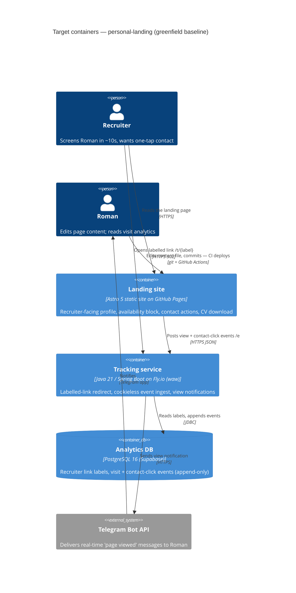

# Architecture map — personal-landing

> **Greenfield foundation** (`mode: greenfield-bootstrap`), fixed by `survey` with Roman.
> The C4 + module inventory below describe the **target baseline** we are about to scaffold; the
> conventions catalog is the rule set the scaffold and every future feature follow. Downstream
> skills (`specify`, `design`, `data-model`, `implement`) read this file — same contract as a
> brownfield map. Refresh with `survey` once the repo drifts past `reflects_commit`.
>
> Source of intent: [[../docs/idea-brief.md]] (`docs/idea-brief.md`). Foundational ADRs:
> `docs/adr/0001`–`0003`.

## Stack

- **Site** — Astro 5 (static output), TypeScript, Tailwind v4. Node 20+ to build. Package manager: npm.
  Content lives in a typed Astro **content collection** (`site/src/content/`) with a Zod schema — the
  "single structured file Roman edits and commits" from the brief.
- **Tracking service** — Java 21, Spring Boot 3.5.x, **Maven** (wrapper `./mvnw`). Spring Web (MVC),
  **Spring Data JDBC** (no JPA/Hibernate), Flyway, PostgreSQL driver, Spring `RestClient` for the
  Telegram Bot API. Tests: JUnit 5 + Testcontainers (Postgres).
- **Datastore** — PostgreSQL 16 on **Supabase** (managed, free tier). Flyway migrations run on boot.
- **Hosting** — Site: **GitHub Pages** (deployed by Actions on merge to `main`). Tracker: **Fly.io**,
  region `waw` (Warsaw), one always-warm `shared-cpu-1x` machine (`min_machines_running = 1` — the
  labelled-link redirect must not wait on a cold JVM).
- **Notifications** — Telegram Bot API; the tracker sends Roman a "page viewed" message.
- **Build / test / lint** — see frontmatter `build_cmd` / `test_cmd` / `lint_cmd`.

## C4 — target system baseline

## Module inventory

| Module | Path | Layers | Wired at | Responsibility |
|---|---|---|---|---|
| site | `site/` | content (Zod schema) / pages / components / public assets | `site/astro.config.mjs` | Static recruiter landing page + `cv.pdf` download |
| tracker | `tracker/` | web (controllers) / app (services) / infra (JDBC repos, Telegram client) / domain (records) | `tracker/src/main/java/com/grupskyi/tracker/TrackerApplication.java` | Labelled-link redirect, event ingest, Telegram notify, health |
| migrations | `tracker/src/main/resources/db/migration/` | — | Flyway auto-runs on tracker boot | Schema for `recruiter_link`, `visit_event` |

## Conventions (the rules a new feature must match)

- **Module wiring / registration:** Astro — integrations declared in `site/astro.config.mjs`.
  Spring — constructor injection only (no field `@Autowired`), components discovered by scan under
  `com.grupskyi.tracker` — `tracker/src/main/java/com/grupskyi/tracker/TrackerApplication.java`.
- **Error handling:** tracker has one `@RestControllerAdvice` returning a JSON envelope
  `{ "error": <code>, "message": <text> }`. Event-ingest endpoints are **fire-and-forget** — a
  logging/DB failure is logged server-side and still returns `202`, never a 5xx to the browser.
- **IDs:** `visit_event.id` = `bigint generated always as identity`; ordering by
  `created_at timestamptz default now()`. `recruiter_link.label` is a human-chosen slug and is the PK.
- **Persistence / DB access:** Spring Data JDBC `CrudRepository` interfaces in the `infra` layer; no
  JPA, no lazy loading. `visit_event` is **append-only** — no `UPDATE`/`DELETE` code path.
- **Migrations:** Flyway, `V<n>__<snake_case_description>.sql` in
  `tracker/src/main/resources/db/migration/`; forward-only (personal-scale, no rollback SQL required
  but keep each migration small and reversible-by-hand).
- **Tests:** JUnit 5. Unit = plain classes. Integration = `@SpringBootTest` + Testcontainers Postgres
  (`tracker/src/test/...`). Site = `astro check` (types) + a successful `astro build`.
- **Inter-module communication:** none direct. The browser (served by `site`) calls `tracker` over
  HTTPS JSON; the two build, test, and deploy independently.
- **UI / styling:** Tailwind v4 with `@theme` tokens in `site/src/styles/global.css`; hand-rolled
  `.astro` components in `site/src/components/`; zero client JS by default (one small inline script
  posts contact-click events).

## Datastores

| Store | Engine | Accessed via | Notes |
|---|---|---|---|
| Analytics DB | PostgreSQL 16 (Supabase, free tier) | Spring Data JDBC + Flyway | Append-only event log. `recruiter_link` is small reference data Roman seeds by hand (one row per outreach). Supabase free tier pauses a project after ~7 days of inactivity — acceptable at personal traffic, note for ops. |

## Frontend / UI foundation

- **Component library / design system:** none — hand-rolled Astro components in `site/src/components/`.
  Deliberate: a ~one-screen recruiter page does not justify a kit.
- **Design tokens:** Tailwind v4 `@theme` block in `site/src/styles/global.css` (colors, spacing,
  font scale).
- **Styling approach:** Tailwind v4 utility classes in `.astro` templates; no CSS-in-JS, no CSS modules.
- **Shared primitives:** to be established by the first UI feature — expect `Section.astro`,
  `ContactButton.astro`, `AvailabilityBlock.astro`, `ProjectCard.astro` under `site/src/components/`.
- **State / data-fetching:** none — the page is static HTML. A single inline `<script>` fires
  `fetch()` calls to the tracker for contact-button clicks.
- **Closest UI precedent:** none yet — the first `specify → … → implement` cycle for the landing
  page itself sets the precedent.

## Where things live / closest precedents

- A new **recruiter-facing page section** → a component in `site/src/components/*.astro`, composed
  into `site/src/pages/index.astro`, styled with Tailwind utilities.
- A new **tracked event type** → Flyway migration adding the column/table + a field on the event
  record (`tracker/.../domain/`) + handling in the ingest controller (`tracker/.../web/`).
- A new **tracker endpoint** → controller in `tracker/.../web/` + service in `tracker/.../app/`,
  constructor-injected.
- A **content field** on the profile → extend the Zod schema in `site/src/content/config.ts`, then
  the data file, then the component that renders it.

## Constraints & known tech-debt

- **Content must be reconciled before it is written.** Surname spelling (Hrupskyi / Grupskyi /
  Grupskiy), employment dates, and years-of-experience disagree across the two CV PDFs and LinkedIn.
  The Zod schema should force the required fields explicit; the reconciliation itself is a `specify`
  open question (idea-brief §8).
- **Redirect latency.** The tracker's `/t/{label}` path is on a recruiter's click path — keep the
  Fly machine warm (`min_machines_running = 1`), no scale-to-zero, no heavy work before the 302.
- **EU data protection.** Named-recruiter visit logs touch GDPR. Kept low-volume and informal for
  v1; a retention/notice line is an idea-brief §8 open question for `specify`.
- **Local toolchain.** This machine runs Node v18.12.1 — the Astro 5 site needs Node 20+ to build
  (`nvm use 20` / bump the default). The scaffold's CI pins Node 20.
- **Free-tier limits.** Supabase pauses inactive free projects (~7 days); Fly.io pay-as-you-go
  allowance covers one tiny warm machine (~$2–4/mo). Acceptable for personal use; revisit if traffic
  grows.
- **No generated PDF at launch.** `site/public/cv.pdf` is a committed static asset (the existing
  "Classic" CV); generating it from page content is iteration two (idea-brief §5).
- **Deferred: browser admin panel.** v1 content is file + git only. The tracker must not grow into
  that backend (idea-brief §5).

## Reconciliation with the authored architecture doc

No authored architecture doc exists. This map is the current reference. `docs/idea-brief.md` is the
upstream intent and is reconciled here — no conflicts (this map realizes its §7 recommendation with
Roman's two overrides: the tracker is Java/Spring Boot rather than an edge worker, and hosting is
GitHub Pages + Fly.io + Supabase rather than a single platform).
