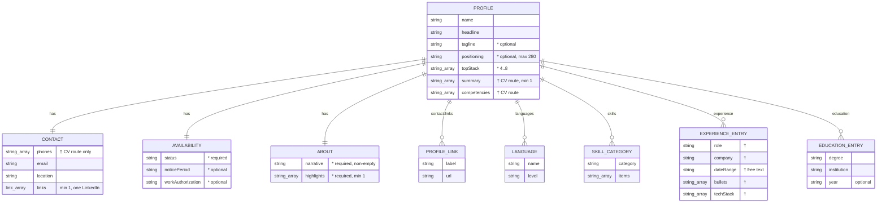

# Data model — personal-landing

<!-- Re-synced 2026-09-07 to the S-size scope (spec.md §1 "Scope narrowing" / §8 follow-up,
     ux-flows.md commit b75fc9f, sad.md §6 commit 9930320):
       + ADD required `about.narrative` + `about.highlights` (US-10 / AC-14)
       + `contact.phones` is CV-route-only — no shape change, no landing render
       - DROP `selectedProjects` + `selectedProject` + INV-05      → v2 (with US-09)
       - DROP `experienceEntry.startYear` / `endYear` + INV-06     → v2 (with US-04)
       - DROP `earlierBackground`                                  → v2 (with US-04)
       ~ `topStack` min raised 1 → 4 (INV-07, spec/CONTEXT "min 4, max 8, build-enforced")
       ~ `availability` gains optional `noticePeriod` (CONTEXT.md Availability block, spec §1)
     Deferred fields stay SCHEMA-ADDITIVE — bringing the v2 sections back needs no reshape. -->

## Scope note — no relational datastore

This feature has **no database, no migration, no runtime persistence**. SAD §6 states it
outright: *"`data-model` has no entity, column, or index to design for this feature."* The
tracker's PostgreSQL + Flyway (`docs/architecture-map.md` §Datastores) is a **separate
service** and is not touched here.

What this feature *does* have is a **structured content document** — the one `profile`
entry in the typed Astro content collection (`site/src/data/profile/roman.json`, schema in
`site/src/content/config.ts`). It is the single source of truth for both the landing page
(`index.astro`) and the CV route (`cv.astro`). ADR-0005 extends it with landing-specific
fields; ADR-0007 adds build-time invariants (`.refine()`). This document is the **finalised
field-shape spec** for that work (ADR-0005 §Consequences: *"the exact field shapes are
finalised by the `data-model` stage"*).

**Staged migrations: none.** There is no SQL and no migration tool in this feature's scope.
The schema change is a TypeScript/Zod edit + a JSON reshape, applied by `implement` as
ordinary task work (see [Schema change](#schema-change-for-implement)). There is nothing to
promote into a live `migrations/` tree.

**v1 scope (post-2026-09-07 narrowing).** The v1 landing page renders the **above-the-fold
scan** + one **About section**. The **experience timeline** (v2, was US-04), the
**selected-work** section (v2, was US-09) and the pre-2017 **earlier-background** line are
cut from v1. Their fields are **not added** to the schema now — the entries below marked
_(v2 — not in v1 schema)_ document the intended additive shape only, so the later feature
re-syncs this doc rather than reshaping the entry. `contact.phones`, `experience[]`,
`skills[]`, `competencies[]`, `summary[]`, `education[]` stay in the schema but render only
on the **CV route** — untouched by this feature.

## ER diagram

The `profile` document is one aggregate. Sub-objects are **embedded** (composition — they
have no independent identity, no store, no FK); `||--o{` / `||--||` read as
"contains" / "contains one".

The inline block below is trimmed for legibility — `*` marks a field **added by
ADR-0005 / this feature**; `†` marks a field that exists but renders **only on the CV
route** (not this feature). Full types and the invariant each field carries are in the
[Entities](#entities) tables directly under it.

## Entities

Only one persisted entity exists — the content document. "Type" is written in Zod
vocabulary (the schema language this repo already uses in `config.ts`). Sub-objects below
are embedded shapes, not separate entities.

### `profile` (content-collection document — aggregate root)

| Field | Type | Constraints | Notes |
|---|---|---|---|
| `name` | `z.string().min(1)` | non-empty | feeds CV filename helper + hero (AC-05) |
| `headline` | `z.string().min(1)` | **required, non-empty** (INV-01) | pipe-separated positioning line; source for CV filename |
| `tagline` | `z.string().min(1).optional()` | absent OK; present-but-empty invalid (AC-06) | **NEW** — optional one-liner under the headline (spec §1) |
| `positioning` | `z.string().min(1).max(280).optional()` | ≤ 280 chars; present-but-empty invalid | **NEW** — optional short positioning paragraph (2–3 sentences) in the hero, fuller than `tagline`; landing-page only (`summary` stays CV-route). Length-capped so it does not break the above-the-fold fit (AC-01/AC-08) — spec §1, §6 drop order |
| `topStack` | `z.array(z.string().min(1)).min(4).max(8)` | **4–8 items** (INV-07) | **NEW** — hand-curated hero technology chips; *not* derived from `skills` (ADR-0005). Min raised 1→4 (spec/CONTEXT "min 4") |
| `contact` | `z.object({…})` | required | embedded — see below |
| `availability` | `z.object({…})` | required | **NEW** embedded — see below |
| `about` | `z.object({…})` | **required** | **NEW** embedded — see below (US-10 / AC-14) |
| `competencies` | `z.array(z.string()).default([])` | — | existing; **CV route only** |
| `languages` | `z.array({ name, level }).default([])` | — | existing; CV route |
| `summary` | `z.array(z.string()).min(1)` | ≥ 1 entry | existing; **CV route only** — not the About narrative |
| `skills` | `z.array(skillCategory).default([])` | — | existing; **CV route only** (full skills matrix is v2 on the landing page) |
| `education` | `z.array(educationEntry).default([])` | — | existing; CV route |
| `experience` | `z.array(experienceEntry).default([])` | — | existing shape **unchanged**; **CV route only** in v1 (timeline is v2) |

**Deferred to v2 — NOT added to the v1 schema** (documented here so the v2 feature re-syncs
this doc, additive, no reshape):

| Field | Intended v2 shape | Belongs to |
|---|---|---|
| `selectedProjects` | `z.array(selectedProject).min(3).max(5)` — `selectedProject = { name, role, impact }` | US-09 selected-work section (was INV-05) |
| `experienceEntry.startYear` / `endYear` | `z.number().int()` / `.nullable()` — replaces free-text `dateRange` parsing; enables the non-overlap check | US-04 experience timeline (was INV-06) |
| `earlierBackground` | `z.string().optional()` — single pre-2017 summary line after the timeline | US-04 experience timeline |

**Forbidden fields (INV-08, AC-07):** the schema **must not** carry `salary`, `rate`,
`compensation`, `homeAddress`, or any per-recruiter tracker link label. Enforced
structurally — the shape has no such key, so a value cannot leak into the page or its
source. Documented, not runtime-checked.

### `contact` (embedded)

| Field | Type | Constraints | Notes |
|---|---|---|---|
| `phones` | `z.array(z.string()).default([])` | — | **shape UNCHANGED from the live schema.** The `{ label, e164 }` reshape proposed on 2026-09-06 was motivated by the AC-03 no-digit chooser, which is **withdrawn** (phone removed from the landing page, spec §1). `contact.phones` renders **only on the CV route** as visible text; the landing page never reads it (AC-07). |
| `email` | `z.string().email()` | **required, `@`-valid** (INV-03/04) | AC-05 required channel; AC-06 shape |
| `location` | `z.string().min(1)` | non-empty | rendered next to availability (AC-01) |
| `links` | `z.array(link).min(1)` | **≥ 1, and one must be LinkedIn** (INV-03) | `.superRefine`: at least one entry whose `url` host is `linkedin.com` — AC-05 names "LinkedIn" if absent |

`link` = `{ label: z.string(), url: z.string().url() }` (unchanged).

**Removed from the target shape:** `contact.availability` (a free-text string on the live
schema) — replaced by the top-level `availability` object below.

### `availability` (embedded — NEW, ADR-0005)

| Field | Type | Constraints | Notes |
|---|---|---|---|
| `status` | `z.string().min(1)` | **required, non-empty** (INV-02) | free text; carries the remote / hybrid / relocation stance (e.g. "Open to Remote & Hybrid Opportunities"). AC-05 required essential; satisfies AC-01's "remote-work stance" |
| `noticePeriod` | `z.string().min(1).optional()` | optional | **NEW** — e.g. "1 month". Part of the **Availability block** per `CONTEXT.md` (reconciled 2026-09-07) and spec §1. _Reverses the 2026-09-06 data-model decision to drop it; see the audit report._ |
| `workAuthorization` | `z.string().min(1).optional()` | optional | e.g. "EU work permit — Poland" |

Location is `contact.location`, not duplicated here. The remote/relocation stance lives
inside `status` — no separate boolean field.

### `about` (embedded — NEW, US-10 / AC-14)

The one below-the-fold content block on the v1 landing page. Reconciled from
`docs/reference/linkedin-about.md` (narrative) + Roman's own text (highlights). **Not** the
CV `summary` array — a distinct field, landing-page only.

| Field | Type | Constraints | Notes |
|---|---|---|---|
| `narrative` | `z.string().min(1)` | **required, non-empty** (INV-09) | short prose paragraph(s); rendered straight from content, no hard-coded copy (AC-14). An empty string fails the build (AC-06). |
| `highlights` | `z.array(z.string().min(1)).min(1)` | **required, ≥ 1 non-empty entry** (INV-09) | short highlight lines (Roman's own text). An empty list fails the build (AC-05); an empty entry fails as malformed (AC-06). |

### `experienceEntry` (embedded — shape UNCHANGED)

The live `config.ts` shape is kept as-is for v1 — `experience[]` renders only on the CV
route, and the landing-page timeline (which needed machine-readable years + a non-overlap
check) is v2. When US-04 lands, this entry gains `startYear` / `endYear` and drops the
free-text `dateRange` (see the deferred-fields table above).

| Field | Type | Constraints | Notes |
|---|---|---|---|
| `role` | `z.string()` | non-empty | existing |
| `company` | `z.string()` | non-empty | existing |
| `companyUrl` | `z.string().url().optional()` | — | existing |
| `project` / `projectUrl` | `z.string()(.url()).optional()` | — | existing; CV route |
| `dateRange` | `z.string()` | — | existing free-text ("2023 – 2026"); **kept for v1** — the derived `formatDateRange()` helper + `startYear`/`endYear` arrive with the v2 timeline |
| `description` | `z.string().optional()` | — | existing |
| `bullets` | `z.array(z.string()).default([])` | — | existing |
| `techStack` | `z.array(z.string()).default([])` | — | existing |

## Invariants (replaces "Indexes" — no queries, no DB)

ADR-0007: all expressed as Zod `.refine()` / `.superRefine()` in `config.ts`, with helper
predicates in `site/src/lib/content-checks.ts` (unit-tested). Every failure must **name the
offending field** (AC-05, AC-06).

| # | Invariant | Rule | AC | Where |
|---|---|---|---|---|
| INV-01 | Headline present | `headline` non-empty | AC-05 | base schema `.min(1)` |
| INV-02 | Availability present | `availability.status` non-empty | AC-05 | base schema `.min(1)` |
| INV-03 | All **three** contact channels present | `contact.email` valid **and** ≥ 1 `contact.links` entry whose `url` host is `linkedin.com` **and** the CV channel (`name` + `headline` present **and** the committed PDF exists at the expected path — postbuild "file exists" assertion, ADR-0008) | AC-05 | `.superRefine` (email + LinkedIn) + postbuild assertion (CV file) |
| INV-04 | Field shapes valid | email contains `@`; every `url` parses; no empty required string; `topStack` ≤ 8 | AC-06 | base Zod (`.email()`, `.url()`, `.min(1)`, `.max(8)`) |
| INV-07 | Top stack size | `topStack.length` in **4..8** | AC-01, AC-06 | base schema `.min(4).max(8)` |
| INV-08 | No over-exposure fields | schema carries no `salary` / `rate` / `homeAddress` / recruiter-link-label key | AC-07 | structural (shape has no such key) — documented |
| INV-09 | About section present | `about.narrative` non-empty **and** `about.highlights.length ≥ 1` with every entry non-empty | AC-05, AC-06, AC-14 | base schema (`.min(1)` on both) — `about` object is required, not `.optional()` |

**Withdrawn with the v2 scope cut (2026-09-07):**

- **INV-05** (selected-projects count + non-placeholder impact) — returns with US-09. The
  placeholder-detection rule (min length, blocked-words list) moves to v2 (spec §8).
- **INV-06** (experience dates sane + non-overlapping) — returns with US-04, once
  `startYear` / `endYear` replace the free-text `dateRange`. Roman's exact non-overlapping
  employment ranges are a v2 item (spec §8).

## Schema change (for `implement`)

No SQL. `implement` applies this under the ADR-0005 / ADR-0007 tasks:

1. **`site/src/content/config.ts`** — extend the `profile` Zod schema:
   - add `tagline?` (`.min(1).optional()`), `positioning?` (`.min(1).max(280).optional()`), `topStack` (`.min(4).max(8)`);
   - add `availability: z.object({ status: z.string().min(1), noticePeriod: z.string().min(1).optional(), workAuthorization: z.string().min(1).optional() })` (required);
   - add `about: z.object({ narrative: z.string().min(1), highlights: z.array(z.string().min(1)).min(1) })` (required);
   - require `contact.links.min(1)` (was `.default([])`);
   - remove the free-text `contact.availability` string;
   - leave `contact.phones`, `experience[]`, `skills[]`, `summary`, `competencies`, `education` **unchanged**;
   - append the `.superRefine` block implementing INV-03 (email present + a `linkedin.com` link).
2. **`site/src/lib/content-checks.ts`** (new) — `hasLinkedInLink(links)` predicate (+ any
   further predicates `plan-tests` calls for); unit-tested. _(The `isPlaceholderImpact` /
   `hasOverlappingRanges` helpers move to v2 with INV-05 / INV-06.)_
3. **CV-channel assertion** — the postbuild step asserts the committed PDF exists at the
   filename derived by `site/src/lib/cv-filename.ts` (ADR-0008); a missing file fails the
   build (AC-04, AC-05 CV channel).
4. **`site/src/data/profile/roman.json`** — reshape to the new schema (see below). The file
   currently holds STUB content for the CV-route fields; real content reconciliation for
   those is roadmap step 2 / spec §8, not this stage. The landing-page fields
   (`about`, `availability`, `topStack`, `tagline`, `positioning`) get real values here.

### `roman.json` reshape (landing fields real; CV-route fields stay STUB)

Current → target deltas:

- `contact.availability: "Open to Remote & Hybrid Opportunities"` (string)
  → `availability: { "status": "Open to Remote & Hybrid Opportunities", "noticePeriod": "<Roman>", "workAuthorization": "<Roman, optional>" }`
- add `about: { "narrative": "<reconciled from linkedin-about.md>", "highlights": ["…", "…"] }`
- add `topStack` (4–8 items — **trim** the current ~11-item screens.md wording to the cap, spec §6 / CONTEXT D-9)
- add `tagline?`, `positioning?` (both optional; present-but-empty is invalid)
- `contact.phones` — **unchanged** (`["+38 063 199 08484", "+48 662 477 198"]`); the first
  value has a digit-count problem (14 digits) — Roman to confirm the correct value **for the
  CV route**, not a v1 landing blocker.
- `contact.links` — keep the single LinkedIn entry (satisfies INV-03); `min(1)` now enforced.

## Test fixtures

Not in any `migrations/` tree — Vitest / `astro:content` fixtures under `site/` in whatever
form the test tasks adopt (`plan-tests` / `tasks` decide the harness). PII guard: use
`example.test`, not Roman's real details, in the *invalid / edge* fixtures.

- `validProfile()` — a fully-populated profile that passes every INV; the GREEN baseline.
- `missingChannelProfile(channel)` — drops `email` or the LinkedIn link → asserts INV-03 names it (AC-05).
- `missingAboutProfile()` — omits `about` entirely → asserts the required-object failure names `about` (AC-05).
- `emptyAboutProfile(part)` — `about.narrative: ""` or `about.highlights: []` → asserts INV-09 names the part (AC-05 / AC-06).
- `malformedProfile(field)` — email without `@`, empty headline, unparseable url, present-but-empty `tagline` → asserts INV-04 (AC-06).
- `undersizeTopStackProfile()` — 3 `topStack` entries → asserts INV-07 min (AC-06).
- `oversizeTopStackProfile()` — 9 `topStack` entries → asserts INV-07 max (AC-06).
- `oversizePositioningProfile()` — a `positioning` string > 280 chars → asserts the `.max(280)` bound (spec §1 / §6 fold-fit guard).
- `missingCvPdfProfile()` — build with no committed PDF at the derived path → asserts the postbuild "file exists" assertion fails (AC-04, AC-05 CV channel).

## Drift check

The target schema compared against the live `config.ts` + `roman.json` (`--drift-only`,
2026-09-07).

| Kind | Finding |
|---|---|
| field-without-column (target has, live lacks) | `tagline`, `positioning`, `topStack`, `availability{ status, noticePeriod?, workAuthorization? }`, `about{ narrative, highlights[] }` — all NEW, added by the ADR-0005 / this-feature task. `roman.json` already carries `tagline` + `positioning` **keys** (currently silently stripped — not in the live schema). |
| shape-mismatch | `contact.links` is `.default([])` live, target `.min(1)`. `contact.availability` is a live free-text string, target is the top-level `availability{}` object. |
| column-without-field | `contact.availability` (live string) — intentionally removed, replaced by `availability{}`. No orphan after the task. |
| no-longer-drift (was flagged 2026-09-06, now reverted) | `contact.phones` shape — target now matches live (`string[]`); the `{label,e164}` reshape is dropped with AC-03. `experienceEntry.dateRange` — kept (the `startYear`/`endYear` swap is v2). |
| content (not schema) drift | `roman.json` CV-route fields (`competencies`, `summary`, `skills`, `experience`) are STUB — roadmap step 2 / spec §8, out of this stage. `languages[2]` reads `{ "name": "Poland", "level": "basic" }` — likely meant "Polish"; flagged for `implement`'s content task. `contact.phones[0]` = `"+38 063 199 08484"` has a digit-count problem — Roman to confirm (CV route). |

No `_drift/*.sql` — there is no database to drift against; the "drift" here is
schema-vs-content and is resolved by the ADR-0005 / this-feature schema task, not a
migration.

## Self-check

| Check | Result |
|---|---|
| Naming matches repo convention | PASS — camelCase fields, `z.*` Zod vocabulary, matches existing `config.ts` (`experienceEntry`, `skillCategory`, `link`). |
| Down / reversibility | N/A — no migration. The schema edit is reverted by `git revert` of the `config.ts` + `roman.json` commit; no data to roll back (build-time only). |
| FK indexes | N/A — no relational store, no FK, no query. Embedded sub-objects only. |
| Convention adherence | PASS — no DB philosophy imposed; follows ADR-0001 (typed content collection as single source), ADR-0005 (extend one entry), ADR-0007 (`.refine()` invariants), ADR-0008 (committed CV PDF — postbuild "file exists" assertion). Deliberate divergence from the skill's SQL-migration default is forced by the feature having no datastore — flagged in [Scope note](#scope-note--no-relational-datastore). |
| Deferred fields stay additive | PASS — `selectedProjects`, `experienceEntry.startYear/endYear`, `earlierBackground` are documented but **not** added; the v2 features re-sync this doc without reshaping the entry. |

## Promote-time hint

Nothing to promote. There is no `migrations/` tree for `site/` and no migration tool in
this feature's scope (`architecture-map.md` `migration_tool` = Flyway, **tracker only**).
`implement` applies the schema change as code (steps 1–4 above) under the ADR-0005 /
ADR-0007 tasks.
