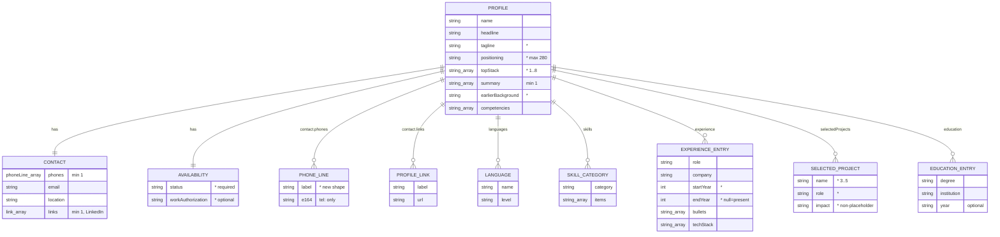

# Data model — personal-landing

## Scope note — no relational datastore

This feature has **no database, no migration, no runtime persistence**. SAD §6 states it
outright: *"`data-model` has no entity, column, or index to design for this feature."* The
tracker's PostgreSQL + Flyway (`docs/architecture-map.md` §Datastores) is a **separate
service** and is not touched here.

What this feature *does* have is a **structured content document** — the one `profile`
entry in the typed Astro content collection (`site/src/data/profile/roman.json`, schema in
`site/src/content/config.ts`). It is the single source of truth for both the landing page
(`index.astro`) and the CV print route (`cv.astro`). ADR-0005 extends it with
landing-specific fields; ADR-0007 adds build-time invariants (`.refine()`). This document
is the **finalised field-shape spec** for that work (ADR-0005 §Consequences: *"the exact
field shapes are finalised by the `data-model` stage"*).

**Staged migrations: none.** There is no SQL and no migration tool in this feature's scope.
The schema change is a TypeScript/Zod edit + a JSON reshape, applied by `implement` as
ordinary task work (see [Schema change](#schema-change-for-implement)). There is nothing to
promote into a live `migrations/` tree.

## ER diagram

The `profile` document is one aggregate. Sub-objects are **embedded** (composition — they
have no independent identity, no store, no FK); `||--o{` / `||--||` read as
"contains" / "contains one".

> **Zoomable / pannable version:** <https://claude.ai/code/artifact/efb542ad-ea8d-4791-9eb2-97087d9fbf6b>
> — same diagram with drag-to-pan and scroll-to-zoom, for when the inline render is too small.
> (A Markdown mermaid block is only as zoomable as its viewer: GitHub offers fullscreen zoom on
> the rendered diagram; most IDE previews do not.)

The inline block below is trimmed for legibility — `*` marks a field **added by ADR-0005**;
full types, constraints and the invariant each field carries are in the [Entities](#entities)
tables directly under it.

## Entities

Only one persisted entity exists — the content document. "Type" is written in Zod
vocabulary (the schema language this repo already uses in `config.ts`). Sub-objects below
are embedded shapes, not separate entities.

### `profile` (content-collection document — aggregate root)

| Field | Type | Constraints | Notes |
|---|---|---|---|
| `name` | `z.string()` | non-empty | feeds CV filename helper + hero |
| `headline` | `z.string().min(1)` | **required, non-empty** (INV-01) | pipe-separated positioning line; source for CV filename |
| `tagline` | `z.string().optional()` | — | **NEW** — optional one-liner under the headline (spec §1) |
| `positioning` | `z.string().max(280).optional()` | ≤ 280 chars | **NEW** — optional short positioning paragraph (2–3 sentences) in the hero, fuller than `tagline`; landing-page only (`summary` stays CV-route). Length-capped so it does not break the above-the-fold fit (AC-01/AC-08) — spec §1 |
| `topStack` | `z.array(z.string()).min(1).max(8)` | **1–8 items** (INV-07) | **NEW** — hand-curated hero technology chips; *not* derived from `skills` (ADR-0005) |
| `earlierBackground` | `z.string().optional()` | — | **NEW** — single "earlier background" line rendered once after the timeline; exempt from AC-09 |
| `contact` | `z.object({…})` | required | embedded — see below |
| `availability` | `z.object({…})` | required | **NEW** embedded — see below |
| `competencies` | `z.array(z.string()).default([])` | — | existing; CV route |
| `languages` | `z.array({ name, level }).default([])` | — | existing |
| `summary` | `z.array(z.string()).min(1)` | ≥ 1 entry | existing; CV route |
| `skills` | `z.array(skillCategory).default([])` | — | existing; CV route |
| `education` | `z.array(educationEntry).default([])` | — | existing; CV route |
| `experience` | `z.array(experienceEntry).default([])` | non-overlapping (INV-06) | shape extended — see below |
| `selectedProjects` | `z.array(selectedProject).min(3).max(5)` | **3–5 entries** (INV-05) | **NEW** — see below |

**Forbidden fields (INV-08, AC-07):** the schema **must not** carry `salary`, `rate`,
`compensation`, `homeAddress`, or any per-recruiter tracker link label. Enforced
structurally — the shape has no such key, so a value cannot leak into the page or its
source. Documented, not runtime-checked.

### `contact` (embedded)

| Field | Type | Constraints | Notes |
|---|---|---|---|
| `phones` | `z.array(phoneLine).min(1)` | **≥ 1 line** (INV-03) | **shape change** — was `string[]`, now `{ label, e164 }[]` for the AC-03 no-digit chooser |
| `email` | `z.string().email()` | **required, `@`-valid** (INV-03/04) | AC-05 required channel; AC-06 shape |
| `location` | `z.string()` | non-empty | rendered next to availability (AC-01) |
| `links` | `z.array(link).min(1)` | **≥ 1, and one must be LinkedIn** (INV-03) | `.refine`: at least one entry whose `url` host is `linkedin.com` — AC-05 names "LinkedIn" if absent |

`link` = `{ label: z.string(), url: z.string().url() }` (unchanged).

`phoneLine` = `{ label: z.string().min(1), e164: z.string().regex(/^\+[0-9 ]{6,}$/) }`
— **NEW shape.** `e164` is the `tel:` target; it is never rendered as visible text (AC-10).
`label` is what the chooser shows ("Call — Poland").

### `availability` (embedded — NEW, ADR-0005)

| Field | Type | Constraints | Notes |
|---|---|---|---|
| `status` | `z.string().min(1)` | **required, non-empty** (INV-02) | free text; carries the remote / hybrid stance (e.g. "Open to Remote & Hybrid Opportunities"). AC-05 required essential; satisfies AC-01's "remote-work stance" |
| `workAuthorization` | `z.string().optional()` | — | optional (e.g. "EU work permit — Poland") |

*Deliberately dropped from ADR-0005's candidate list (per Roman, 2026-09-06):* a separate
`remote`/`relocation` field and `noticePeriod`. The remote stance lives inside `status`;
notice period is handled in conversation. Location is `contact.location`, not duplicated
here.

### `experienceEntry` (embedded — shape extended)

| Field | Type | Constraints | Notes |
|---|---|---|---|
| `role` | `z.string()` | non-empty | existing |
| `company` | `z.string()` | non-empty | existing |
| `companyUrl` | `z.string().url().optional()` | — | existing |
| `project` / `projectUrl` | `z.string()(.url()).optional()` | — | existing; CV route |
| `startYear` | `z.number().int().gte(1990).lte(2100)` | **required** (INV-06) | **NEW** — machine-readable; replaces free-text parsing |
| `endYear` | `z.number().int().gte(1990).lte(2100).nullable()` | `null` = present | **NEW** — a current role sets `null`; renders "<startYear>–present" (AC-09) |
| `description` | `z.string().optional()` | — | existing; the "contribution" line (AC-09) |
| `bullets` | `z.array(z.string()).default([])` | — | existing |
| `techStack` | `z.array(z.string()).default([])` | — | existing |

**Removed:** `dateRange: z.string()`. The display string ("2021–2023", "2023–present") is
**derived** from `startYear`/`endYear` by a shared `formatDateRange()` helper
(`site/src/lib/`), used by `index.astro` and `cv.astro` — one less drift vector, and the
overlap invariant now runs on integers, not string parsing.

### `selectedProject` (embedded — NEW, ADR-0005 / AC-11 / AC-12)

| Field | Type | Constraints | Notes |
|---|---|---|---|
| `name` | `z.string().min(1)` | non-empty | project / product name |
| `role` | `z.string().min(1)` | non-empty | Roman's role on it |
| `impact` | `z.string()` | **non-placeholder** (INV-05) | what changed because of Roman's work; quantified where a number exists (AC-11) |

## Invariants (replaces "Indexes" — no queries, no DB)

ADR-0007: all expressed as Zod `.refine()` / `.superRefine()` in `config.ts`, with helper
predicates in `site/src/lib/content-checks.ts` (unit-tested). Every failure must **name the
offending field** (AC-05, AC-06, AC-12).

| # | Invariant | Rule | AC | Where |
|---|---|---|---|---|
| INV-01 | Headline present | `headline` non-empty | AC-05 | base schema `.min(1)` |
| INV-02 | Availability present | `availability.status` non-empty | AC-05 | base schema `.min(1)` |
| INV-03 | All four contact channels present | `contact.phones.length ≥ 1` **and** `contact.email` valid **and** ≥ 1 `contact.links` entry on `linkedin.com` **and** `name` + `headline` present (the CV channel) | AC-05 | `.superRefine` |
| INV-04 | Field shapes valid | email contains `@`; every `url` parses; no empty required string | AC-06 | base Zod (`.email()`, `.url()`, `.min(1)`) |
| INV-05 | Selected projects: count + non-placeholder impact | `selectedProjects.length` in 3..5; each `impact` is non-empty, ≥ 40 chars after trim, and does not match the blocked-words list `/\b(TODO\|TBD\|FIXME\|XXX\|lorem\|placeholder)\b/i` | AC-11, AC-12 | `.superRefine` → `isPlaceholderImpact()` in `content-checks.ts` |
| INV-06 | Experience dates sane + non-overlapping | for each entry `endYear === null \|\| startYear ≤ endYear`; and no two entries' `[startYear, endYear ?? currentYear]` ranges overlap | AC-09 | `.superRefine` → `hasOverlappingRanges()` in `content-checks.ts` |
| INV-07 | Top stack size | `topStack.length` in 1..8 | AC-01 | base schema `.min(1).max(8)` |
| INV-08 | No over-exposure fields | schema carries no `salary` / `rate` / `homeAddress` / recruiter-link-label key | AC-07 | structural (shape has no such key) — documented |

> **Open (spec §8, owned):** the exact "placeholder impact" rule (min length, blocked-words
> list) — INV-05 above is the documented default (≥ 40 chars + the six blocked words),
> owner: Roman/design, due: before `sdd:implement`. The exact non-overlapping employment
> year ranges — owner: Roman, due: before `sdd:tasks`; INV-06 enforces non-overlap once the
> years are set.

## Schema change (for `implement`)

No SQL. `implement` applies this under the ADR-0005 / ADR-0007 tasks:

1. **`site/src/content/config.ts`** — extend the `profile` Zod schema:
   - add `tagline?`, `positioning?` (`.max(280)`), `topStack` (1–8), `earlierBackground?`, `availability { status, workAuthorization? }`, `selectedProjects` (3–5 × `{ name, role, impact }`);
   - change `contact.phones` from `z.array(z.string())` to `z.array(phoneLine)` where `phoneLine = { label, e164 }`;
   - require `contact.links.min(1)`;
   - in `experienceEntry`: add `startYear` / `endYear` (nullable), remove `dateRange`;
   - remove the free-text `contact.availability` string;
   - append the `.superRefine` block implementing INV-03, INV-05, INV-06.
2. **`site/src/lib/content-checks.ts`** (new) — `isPlaceholderImpact(s)`, `hasOverlappingRanges(entries)`; unit-tested.
3. **`site/src/lib/format-date-range.ts`** (new, or in an existing `lib` module) — `formatDateRange(startYear, endYear)` → `"2021–2023"` / `"2023–present"`; shared by `index.astro` + `cv.astro`.
4. **`site/src/data/profile/roman.json`** — reshape to the new schema (see below). The file currently holds STUB content; real content reconciliation is spec §8 / roadmap step 2, not this stage.

### `roman.json` reshape (illustrative — real values are Roman's to fill)

Current → target deltas:

- `contact.phones: ["+38 063 199 08484", "+48 662 477 198"]`
  → `contact.phones: [{ "label": "international", "e164": "+380631990848" }, { "label": "Poland", "e164": "+48662477198" }]`
  *(note: the current first number "+38 063 199 08484" has a digit-count problem — Roman to confirm the correct E.164 value.)*
- `contact.availability: "Open to Remote & Hybrid Opportunities"` (string)
  → `availability: { "status": "Open to Remote & Hybrid Opportunities" }`
- add `topStack`, `tagline?`, `positioning?`, `earlierBackground?`, `selectedProjects` (3–5).
- each `experience[]` entry: replace `"dateRange": "2023 - 2026"` with `"startYear": 2023, "endYear": null` (or a real end year).

## Test fixtures

Not in any `migrations/` tree — Vitest/`astro:content` fixtures under `site/` in whatever
form the test tasks adopt (`tasks` / `plan-tests` decide the harness). PII guard: use
`example.test`, not Roman's real details, in the *invalid/edge* fixtures.

- `validProfile()` — a fully-populated profile that passes every INV; the GREEN baseline.
- `missingChannelProfile(channel)` — drops one of phone / email / linkedin → asserts INV-03 names it (AC-05).
- `malformedProfile(field)` — email without `@`, empty headline, unparseable url → asserts INV-04 (AC-06).
- `placeholderImpactProfile()` — one `selectedProjects` entry with `impact: "TODO"` / a 12-char string → asserts INV-05 names that project (AC-12).
- `overlappingExperienceProfile()` — two entries `2021–2024` and `2023–2026` → asserts INV-06 (AC-09).
- `oversizeTopStackProfile()` — 9 `topStack` entries → asserts INV-07.
- `oversizePositioningProfile()` — a `positioning` string > 280 chars → asserts the `.max(280)` bound (spec §1 fold-fit guard).

## Drift check

The `explorer` step compared the target schema against the live `config.ts` + `roman.json`.

| Kind | Finding |
|---|---|
| field-without-column | `tagline`, `positioning`, `topStack`, `earlierBackground`, `availability{}`, `selectedProjects[]`, `experience[].startYear/endYear` — all NEW, absent from live schema. Added by ADR-0005 task. |
| shape-mismatch | `contact.phones` is `string[]` live, target `{label,e164}[]`. `contact.availability` is a live string, target is the `availability{}` object. `experienceEntry.dateRange` (live string) removed in favour of `startYear`/`endYear`. |
| column-without-field | `experienceEntry.dateRange` — intentionally removed (display now derived). `contact.availability` string — replaced. No orphan left after the ADR-0005 task. |
| content (not schema) drift | `roman.json` is almost entirely STUB (`competencies`, `summary`, `skills`, `experience`). `languages[2]` reads `{ "name": "Poland", "level": "basic" }` — likely meant "Polish". Out of this stage's scope — roadmap step 2 / spec §8 content reconciliation; flagged for `implement`'s content task. |

No `_drift/*.sql` — there is no database to drift against; the "drift" here is schema-vs-fixture and is resolved by the ADR-0005 schema task, not a migration.

## Self-check

| Check | Result |
|---|---|
| Naming matches repo convention | PASS — camelCase fields, `z.*` Zod vocabulary, matches existing `config.ts` (`experienceEntry`, `skillCategory`, `link`). |
| Down / reversibility | N/A — no migration. The schema edit is reverted by `git revert` of the `config.ts` + `roman.json` commit; no data to roll back (build-time only). |
| FK indexes | N/A — no relational store, no FK, no query. Embedded sub-objects only. |
| Convention adherence | PASS — no DB philosophy imposed; follows ADR-0001 (typed content collection as single source), ADR-0005 (extend one entry), ADR-0007 (`.refine()` invariants). Deliberate divergence from the skill's SQL-migration default is forced by the feature having no datastore — flagged in [Scope note](#scope-note--no-relational-datastore). |

## Promote-time hint

Nothing to promote. There is no `migrations/` tree for `site/` and no migration tool in
this feature's scope (`architecture-map.md` `migration_tool` = Flyway, **tracker only**).
`implement` applies the schema change as code (steps 1–4 above) under the ADR-0005 /
ADR-0007 tasks.
