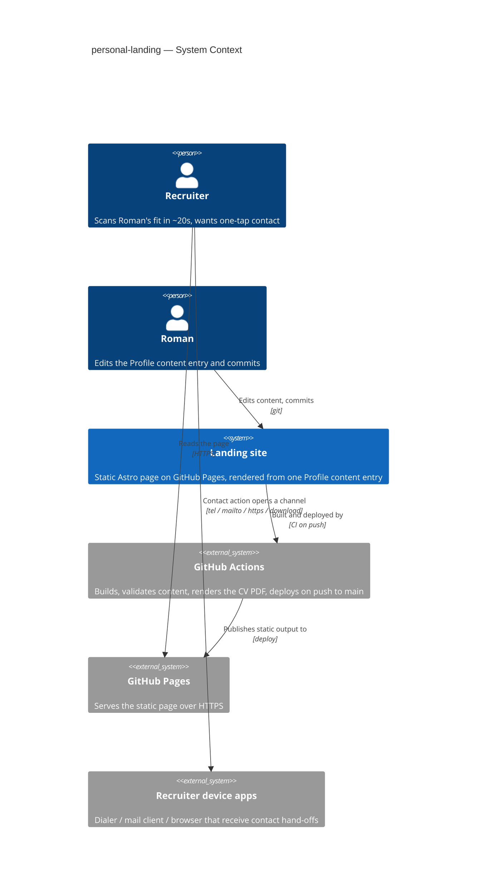
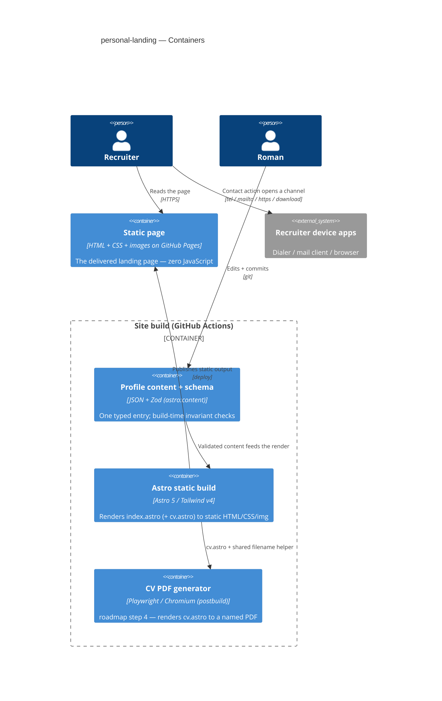
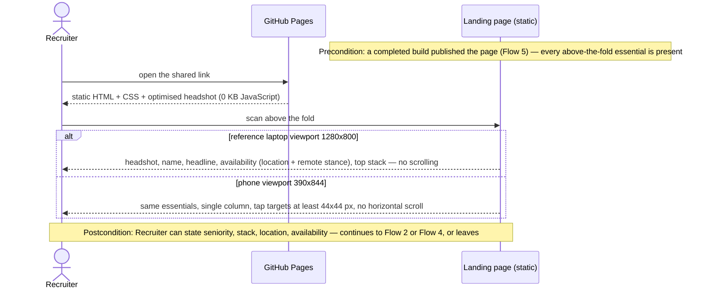
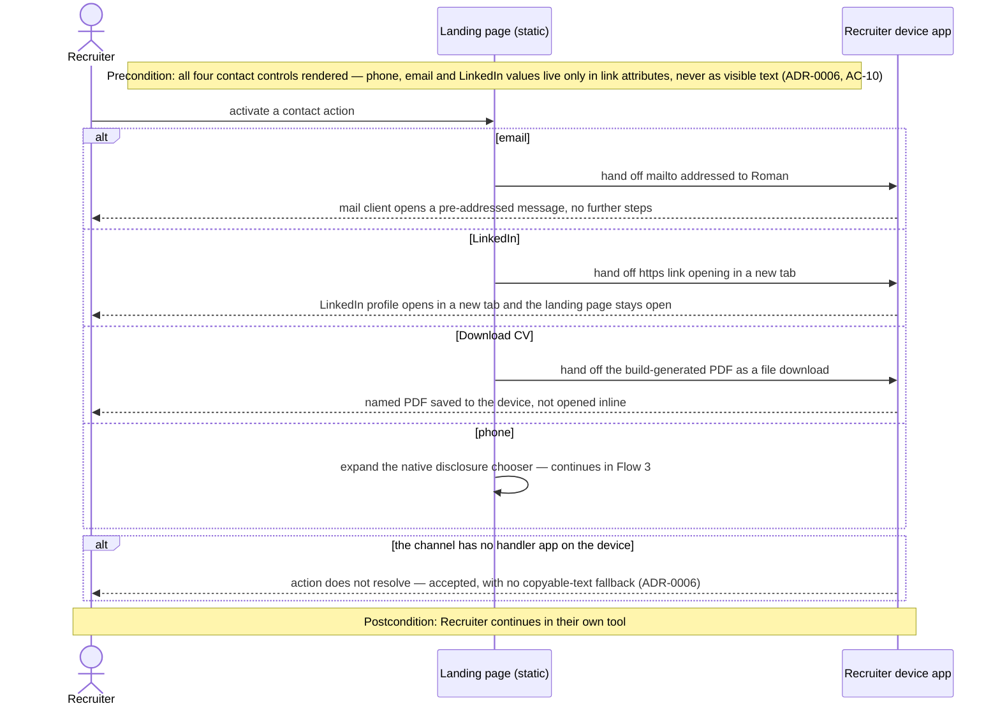
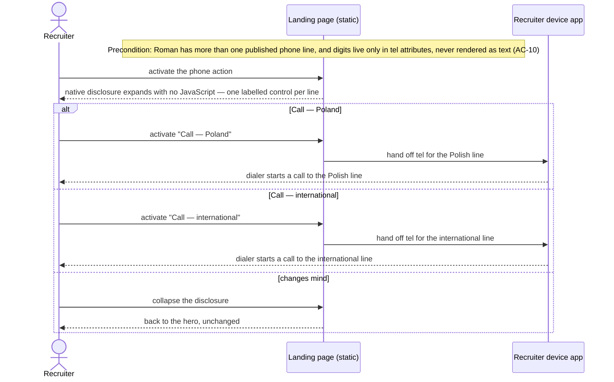
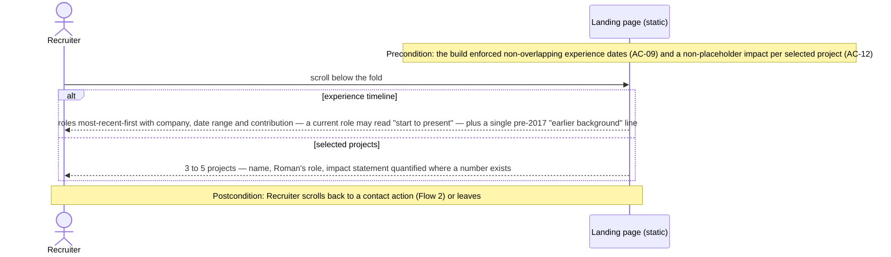
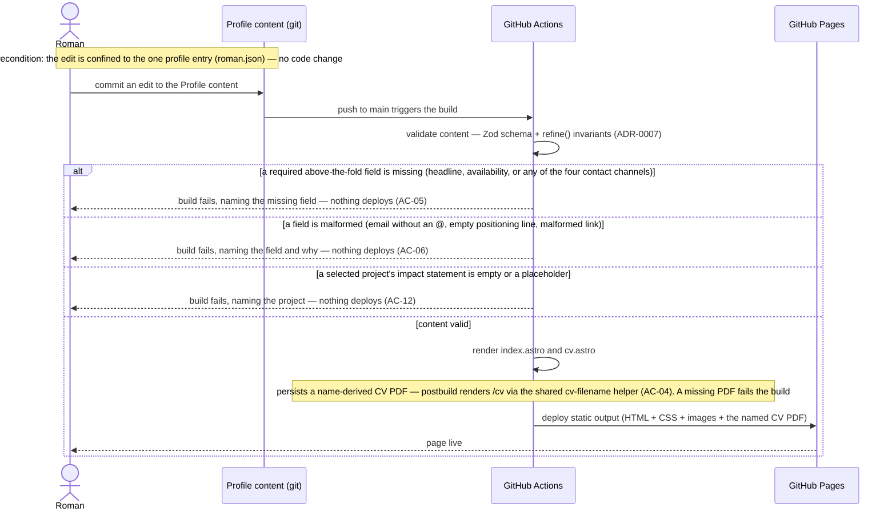

# Software Architecture Document — personal-landing

<!-- 12 Arc42 sections. C4 Context (L1) inline in §3, C4 Container (L2) inline in §5.
     Numbers in §10 come VERBATIM from spec.md §6 NFR. -->

## 1. Introduction and goals

**Intent.** Build one static landing page (`site/src/pages/index.astro`) that lets a **Recruiter** judge Roman's fit in a twenty-second above-the-fold scan and reach him through phone, email, LinkedIn, or a CV download in one tap, and lets **Roman** publish every change by committing a single content file. The page renders entirely from the one typed **Profile content** entry that also feeds the CV print route (roadmap step 4). This feature is roadmap step 3; the stack (Astro 5 static site, Tailwind v4, typed content collection, zero client JS) is fixed upstream by `docs/architecture-map.md` and ADR-0001–0004.

**Top-3 quality goals (1-liners; full scenarios in §10):**

1. **Above-the-fold render speed** — the scan is usable within 2.5 s on a mid-tier phone over 4G.
2. **Never ship a broken or incomplete page** — missing or malformed Profile content fails the build; nothing incomplete deploys.
3. **Zero-JavaScript, accessible delivery** — the page and every contact action work with no client script, at ≥ 95 Lighthouse accessibility.

**Stakeholders.**

| Role | Interest | Sign-off owner? |
|---|---|---|
| Recruiter | Opens the link, scans fit, makes contact | No |
| Roman | Authors the Profile content, owns the page, reads analytics later | Yes |
| Tech Lead (Roman) | SAD approval | Yes |

<!-- Decision overrides (¶4) — populated by the critic resolution loop, empty otherwise. -->

## 2. Constraints

**Technical.**
- Node 20+; Astro 5 (static output); TypeScript; Tailwind v4 with `@theme` tokens in `site/src/styles/global.css`.
- Content in a typed Astro content collection — `site/src/data/profile/*.json`, Zod schema in `site/src/content/config.ts`. One `profile` entry is the single source of truth for the landing page **and** the CV route.
- Zero client JavaScript by default (ADR-0001); the click-tracking beacon is roadmap step 8, not this feature.
- The CV print route (`site/src/pages/cv.astro`) layout is locked to `docs/reference/cv-template-reference.pdf` (ADR-0004) — this feature does not touch it, but shares the content entry and the CV-filename helper with it.
- Build/test/lint: `npm --prefix site run build` / `check` (`astro check`) / `lint`.

**Organisational.**
- Solo developer (Roman). Effort budget: about one week.
- Deadline: "live within the week" — soft; ship-fast beats ship-complete.
- Roadmap step 4 (CV PDF route) is sequenced to land together with this feature.

**Conventions.**
- `CLAUDE.md` (repo root) + `docs/architecture-map.md` §Conventions.
- Hand-rolled `.astro` components in `site/src/components/`; no component kit.
- Locale-clean: no hard-coded English in non-content-driven markup — copy comes from Profile content or is structural.

**Regulatory / external.**
- EU data protection: the only personal data is Roman's own, self-published. No visitor data is collected by this feature (tracking is roadmap steps 6–8). Security review N/A (spec §6.1).

## 3. Context and scope

The landing site is a public, statically-hosted page. A **Recruiter** reaches it through a link Roman puts in his CV, LinkedIn, or outreach email (or, later, a labelled `/t/{label}` redirect — roadmap step 5, not part of this feature) and interacts with it entirely client-side: reading, scrolling, and activating contact actions that hand off to the recruiter's own phone, mail client, or browser. **Roman** changes what the page shows only by editing the Profile content entry and committing; GitHub Actions builds and deploys. There is no runtime backend and no external service call from the delivered page. The trust boundary is the git repository: the only input that shapes the page is content Roman commits, validated at build time.

<!-- brownfield: the Astro site skeleton, the `profile` content collection + Zod schema, `index.astro`/`cv.astro` stubs, and the GitHub Pages deploy workflow already exist (scaffold, commit b1583df). This feature fills them in. `docs/architecture-map.md` reflects_commit a647c5d (pre-scaffold) but describes the same target baseline. -->

**External systems (in / out):**

| Actor or system | Type | Interaction |
|---|---|---|
| Recruiter | Person | Opens the page over HTTPS; reads; activates contact actions (all client-side) |
| Roman | Person | Edits the Profile content entry, commits to the repo |
| GitHub Actions | System (external) | Builds the site on push to `main`, renders the CV PDF, deploys |
| GitHub Pages | System (external) | Serves the static page over HTTPS |
| Recruiter's device apps | System (external) | Dialer, mail client, browser — receive the contact-action hand-offs (`tel:` / `mailto:` / new tab / file download) |

**C4 Context (L1):**



## 4. Solution strategy

**Target surface:** `web-frontend` — one statically-generated web page. No backend, no API, no other surface. (The CV PDF route is a sibling feature; the tracker is a separate service.) **UI architecture:** static site generation (SSG) — the page is fully rendered at build time; there is no SPA, no hydration, no client router. This is inherited from ADR-0001, restated here as this feature's UI-architecture decision; it does not cross the blast-radius gate (already locked upstream) so it is recorded inline, not as a new ADR.

**Top strategic choices (the seeds for ADRs):**

1. **One Profile content entry, extended with landing-specific structured fields** — the landing page needs data the CV template does not carry (a `tagline`, a curated `topStack`, `selectedProjects` with impact, a structured availability block, labelled phone lines, an `earlierBackground` line). These are added as fields on the same `profile` entry rather than a separate collection or derived implicitly from CV fields, so the "one source, two renderers" invariant holds and nothing drifts. → **ADR-0005**.
2. **Contact details are actionable-only, in link attributes, zero client JavaScript** — phone / email / LinkedIn never render as visible text on the page; each is a plain link (`tel:` / `mailto:` / `https:` new tab) and the phone chooser is a native `<details>` disclosure. No script assembles or obfuscates the values in v1. → **ADR-0006** (resolves spec §8 Q3).
3. **Content invariants enforced at build time in the content-collection schema** — required fields, all four contact channels present, a non-placeholder impact statement per selected project, non-overlapping experience dates: expressed as Zod schema rules (`.refine`) so `astro check` / the build fails and names the offending field. No incomplete page can deploy. → **ADR-0007**.

Tactical decisions (hand-rolled components, the shared CV-filename helper, image optimisation via `astro:assets`) trace to these seeds and to the repo conventions; they are recorded in §5 / §8, not as ADRs.

## 5. Building block view

Layered by responsibility within a single static-site build: **content** (the typed entry + schema + invariants), **presentation** (page + hand-rolled components), **shared helpers** (CV filename, content-invariant checks), **assets** (the optimised headshot). There is no domain/app/infra split — nothing runs at request time.

**Internal decomposition:**

```
site/
├── src/
│   ├── data/profile/roman.json         one Profile content entry (single source of truth)
│   ├── content/config.ts               Zod schema + .refine() content invariants  (ADR-0007)
│   ├── pages/
│   │   ├── index.astro                 the landing page — THIS feature
│   │   └── cv.astro                    CV print route — roadmap step 4 (shares content + helper)
│   ├── components/
│   │   ├── Section.astro               below-the-fold section wrapper
│   │   ├── Hero.astro                  above-the-fold: headshot, name, headline, tagline, positioning
│   │   ├── AvailabilityBlock.astro     status / location / remote / notice / work auth
│   │   ├── ContactActions.astro        the four labelled controls (ADR-0006); each carries a stable data-* hook for step 8
│   │   ├── PhoneChooser.astro          native <details> — two labelled call controls
│   │   ├── ExperienceTimeline.astro    most-recent-first roles
│   │   ├── SelectedProjects.astro      3–5 project entries
│   │   └── ProjectCard.astro           one project + impact statement
│   ├── lib/
│   │   ├── cv-filename.ts              name + headline → "Roman-Hrupskyi-…-CV.pdf"  (shared with cv.astro + generate-pdf.mjs)
│   │   └── content-checks.ts           placeholder/overlap helpers used by config.ts refinements
│   ├── assets/roman.jpg                optimised headshot (via astro:assets)
│   └── styles/global.css               Tailwind v4 @theme tokens
└── scripts/generate-pdf.mjs            roadmap step 4 — consumes cv.astro + cv-filename.ts
```

**C4 Container (L2):**



## 6. Runtime view

The runtime view has two theatres: the **client side** (a Recruiter reading a static page and handing off to their own apps — Flows 1–4) and the **build/deploy pipeline** (Roman publishes a content change — Flow 5). There is no request-time service and no datastore; every error the spec demands is a build-time gate (Flow 5) or an accepted unresolved hand-off (Flow 2). Participants are concrete, matching the §3 / §5 C4 models.

### Flow 1 — Recruiter scans the landing page

*Realises US-01, US-06. Covers AC-01 (laptop scan) and AC-08 (phone viewport).*



### Flow 2 — Recruiter makes contact

*Realises US-02, US-05. Covers AC-02 (email), AC-13 (LinkedIn tab, CV download), AC-04 (download side), AC-10 (no visible contact text).*



### Flow 3 — Recruiter chooses a phone line

*Realises US-03. Covers AC-03 and AC-10.*



### Flow 4 — Recruiter reads the depth sections

*Realises US-04, US-09. Covers AC-09 (experience timeline) and AC-11 (selected projects).*



### Flow 5 — Roman publishes a content change

*Realises US-07, US-08. Covers AC-05 (missing essential), AC-06 (malformed field), AC-12 (placeholder impact), AC-04 (named-PDF generation at build).*



### Flagged for `data-model` / follow-up

- **No datastore, no schema.** The only "persist" step in any flow is the build-time generation of the named CV PDF (Flow 5). `data-model` has no entity, column, or index to design for this feature — expect an N/A skip to `api`.
- **Pipeline trigger, drawn as sync.** Flow 5's `push to main triggers the build` is event-driven, but it is an internal CI trigger, not a third-party callback — no idempotency key, retry note, or dead-letter branch is warranted. GitHub Actions' own re-run semantics are outside this view.
- **AC-07 is only partly runtime.** The "no visible contact text" half is the `Note` in Flows 2 and 3. The "no salary / no home address / no per-recruiter link labels anywhere in the delivered source" half is a build-output / source-inspection property with no runtime flow — verified by `plan-tests`, not shown here.

## 7. Deployment view

Reuses the scaffold's deployment unit unchanged: GitHub Actions builds `site/` on push to `main` (`npm --prefix site run build` = `astro build` + the `postbuild` Playwright/Chromium PDF step) and deploys the static output to GitHub Pages. `astro build` validates the `profile` content collection against the Zod schema **and its `.refine()` invariants** and fails on any violation — this is what gates the deploy (ADR-0007). `astro check` (type-checking) and `astro` lint run as separate CI steps on pull requests only (`ci.yml`), not on the deploy path; `tasks` should add `npm run check` + the invariant unit tests to `deploy.yml` so a direct push to `main` is also type-gated. No server, no container, no datastore for this feature. The build job already installs Chromium for the PDF (scaffold).

**Monitoring:**
- No runtime monitoring — the page is static files on a CDN.
- Build health: the GitHub Actions run is the signal; a red build blocks the deploy.
- Lighthouse (LCP, weight, accessibility) is run manually pre-launch and after significant content changes; wiring it into CI is a later improvement (§11).

**Scaling thresholds:**
- Static hosting on GitHub Pages — effectively unbounded read traffic; no scaling action for this feature at any realistic recruiter volume.
- Page weight budget ≤ 500 KB transferred (§10) — the headshot is the only large asset and is optimised at build (§8).

## 8. Crosscutting concepts

| Concept | Convention | Where defined |
|---|---|---|
| Single source of truth | The landing page and the CV route both render from one `profile` entry; no page-specific copy in components | `CONTEXT.md` invariant · ADR-0005 |
| Content validation | Zod schema + `.refine()` invariants (required fields, all four contact channels, non-placeholder impact, non-overlapping dates) fail the build and name the field | ADR-0007 · `site/src/content/config.ts` |
| Client JavaScript | None. Progressive enhancement only; phone chooser is a native `<details>`; contact actions are plain links | ADR-0001 · ADR-0006 |
| Contact-detail exposure | Phone / email / LinkedIn never rendered as visible text on the page; values live only in link attributes; not obfuscated in v1 (revisit — §11) | ADR-0006 · `CONTEXT.md` invariant |
| Images | Headshot processed by `astro:assets` — responsive sizes, modern format, explicit dimensions, eager + high fetch-priority for the LCP element | §5 `src/assets/` · here |
| Accessibility | Semantic HTML, one `<h1>`, keyboard-operable controls, body text ≥ 16 px, interactive targets ≥ 44×44 px (WCAG 2.5.8), Lighthouse a11y ≥ 95 | spec §6 · here |
| Tracking hooks (for step 8) | Every contact control carries a stable `data-contact-channel` (`phone` / `email` / `linkedin`) or `data-cv-download` attribute; roadmap step 8's inline beacon script binds to these — no markup change needed then | spec §3 · `architecture-map.md` §Frontend · here |
| Error handling | Build-time only — a validation failure stops the build with a named field. No runtime error path exists (static delivery) | ADR-0007 |
| Localisation | Single language (English) in v1; schema and components stay locale-clean so a per-locale entry is additive later | `architecture-map.md` §Constraints |
| Observability / logging | N/A at runtime (static files); build logs are the GitHub Actions run | — |
| CV filename | Derived from `name` + `headline` by `site/src/lib/cv-filename.ts`, shared by `index.astro`, `cv.astro`, and `generate-pdf.mjs` — never hand-copied. Roadmap step 4 owns the derivation rule; this feature consumes the same helper | §5 `lib/cv-filename.ts` · `docs/adr/0004` |

## 9. Architecture decisions

| # | Title | Status | Section |
|---|---|---|---|
| 0005 | Extend the single profile entry with landing-specific structured fields | Accepted | §4 |
| 0006 | Contact details as actionable-only link attributes, zero client JavaScript | Accepted | §4 |
| 0007 | Enforce content invariants in the content-collection schema at build time | Accepted | §4 |

Inherited foundational ADRs (not re-decided here): `docs/adr/0001` (Astro static site + typed content collection), `0004` (CV PDF generated from a print route at build time).

ADR files live under `docs/features/personal-landing/adr/NNNN-<title>.md`.

## 10. Quality requirements

**QG-1. Above-the-fold render speed**
- **When:** a Recruiter opens the page on a mid-tier mobile device over throttled 4G (Lighthouse "mobile" preset).
- **Then:** Largest Contentful Paint ≤ 2.5 s; initial page weight ≤ 500 KB transferred; 0 KB of client JavaScript shipped by this feature.
- **How verify:** Lighthouse mobile audit run manually pre-launch; build-output inspection for the JS figure; build size report for weight.

**QG-2. Never ship a broken or incomplete page**
- **When:** the Profile content is missing or has a malformed required field — no headline, no availability, any of the four contact channels absent, an empty/placeholder project impact statement, or overlapping experience dates.
- **Then:** 100% of missing / malformed required fields fail the build, which names the offending field; nothing is published.
- **How verify:** `astro build` enforces the content-collection schema and its `.refine()` invariants and gates the deploy (ADR-0007); unit tests over the invariant predicates with fixture profiles; `astro check` on pull requests (and, once `tasks` adds it, on the deploy path).

**QG-3. Zero-JavaScript, accessible, correctly-scaled delivery**
- **When:** a Recruiter uses the page with JavaScript disabled, or with a keyboard / screen reader, on any viewport from 360 to 1920 px wide.
- **Then:** every contact action works; Lighthouse Accessibility ≥ 95; every interactive element is keyboard-reachable and operable; body text ≥ 16 px; interactive targets ≥ 44×44 px; no horizontal scroll at 360 / 768 / 1280 / 1920 px width; and every above-the-fold essential is visible with no scrolling at 1280×800 (reference laptop) and 390×844 (reference phone).
- **How verify:** Lighthouse mobile audit + manual keyboard pass + manual responsive check at the four widths + manual above-the-fold check at 1280×800 and 390×844, all pre-launch.

## 11. Risks and technical debt

| Risk / debt | Severity | Mitigation | Owner |
|---|---|---|---|
| Roadmap step 4 (CV PDF) slips — the Download-CV control has no file | Medium | Steps 3 and 4 sequenced together; a missing generated PDF fails the build (postbuild assertion) so a dead link never ships | Roman |
| Headshot asset is ~2 MB — blows the 500 KB page-weight budget if shipped raw | Medium | `astro:assets` optimisation, responsive sizes, target < 100 KB at display size; checked in the QG-1 Lighthouse pass | Roman |
| Optional `positioning` block + tagline together push the contact actions off the fold at 390×844 (AC-08) | Low | Schema caps `positioning` at 280 chars (`data-model`); manual above-the-fold check at 390×844 in the QG-3 pass; both fields are optional so the tight layout is opt-in | Roman |
| Lighthouse checks (and `astro check` on the deploy path) are manual / PR-only, not on push to `main` — quality can regress silently on a later direct content edit | Low | `tasks` adds `npm run check` + invariant unit tests to `deploy.yml`; document the pre-launch Lighthouse checklist; wire Lighthouse CI as a later improvement | Roman |
| Open question: exact non-overlapping employment date ranges | Open question | Resolve before `sdd:tasks`; spec §8 — default is the CV-template ranges with the EveryMatrix overlap collapsed | Roman |
| Open question: per-project impact statements + the build-time placeholder-detection rule | Open question | Resolve before `sdd:implement`; spec §8 — Roman supplies statements; rule default is non-empty + ≥ 40 chars + blocked-words list | Roman / design |

**Accepted debt (acceptable in v1, plan to fix later):**
- Contact values obfuscation: **resolved for v1 by ADR-0006** — link-attributes-only, no script. Casual scraping is still possible (the values are in the `href`s); the same data is in Roman's public CV. Revisit trigger: observed scraping abuse → switch to script-assembled-on-click (spec §8 Q3).
- No automated visual-regression or Lighthouse gate in CI — manual pre-launch checks only.

## 12. Glossary

Domain terms are canonical in `CONTEXT.md` (Recruiter, Roman, Profile content, Availability block, Contact action, Above-the-fold scan, Headline, Tagline, Top stack, Experience timeline, Selected project, Impact statement, Labelled link). SAD-specific terms:

| Term | Meaning |
|---|---|
| SSG (static site generation) | The whole page is rendered to HTML/CSS/images at build time; no server rendering, no client hydration, no router |
| Content invariant | A rule the Profile content must satisfy to build — e.g. "all four contact channels present", "no placeholder impact statement", "experience dates do not overlap"; expressed as a Zod `.refine()` |
| Actionable-only | A contact detail exposed only as an activatable control (a link), never as readable text on the page |
| Reference viewport | 1280×800 (laptop) and 390×844 (phone) — the sizes "fits above the fold" and "no horizontal scroll" are checked against |
| LCP | Largest Contentful Paint — the render-speed metric in QG-1, target ≤ 2.5 s on the Lighthouse mobile preset |
