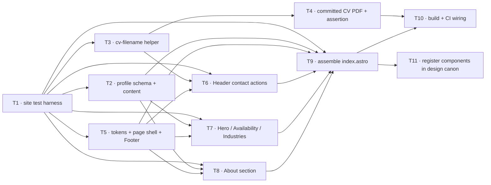

# Epic — personal-landing

> **Spec:** [spec.md](../spec.md) · **Design:** [sad.md](../sad.md) · **Data model:** [data-model.md](../data-model.md) · **API:** [contracts/api-sync-report.md](../contracts/api-sync-report.md) (N/A — no interface) · **ADRs:** [adr/](../adr/) · **Screens:** [screens.md](../screens.md) · **UX flows:** [ux-flows.md](../ux-flows.md)

## Goal

Ship one static Astro landing page (`site/src/pages/index.astro`) that lets a Recruiter judge
Roman's fit in a twenty-second above-the-fold scan and reach him — email, LinkedIn, or a named CV
download — from a persistent CSS-only header, plus one short About section below the fold. The page
renders entirely from the single typed `profile` content entry; missing or malformed required
content fails the build. Zero client JavaScript. (Spec §2 Goals.)

## Scope

- **In:** the `profile` content schema + build-time invariants (`config.ts`, `content-checks.ts`,
  `roman.json`); the shared CV-filename helper; a committed CV PDF under `site/public/` + a
  build-time "file exists" assertion; design tokens + page shell + `Footer`; the `Header`
  (contact actions + mobile `
` menu); `Hero` / `AvailabilityBlock` / `Industries`;
  `Section` / `AboutMe`; `index.astro` assembly; CI/deploy wiring; design-canon registration.
- **Out (spec §3):** no phone control (US-03 removed); no experience timeline (US-04 → v2); no
  selected-work section (US-09 → v2); no skills matrix / testimonials; **no CV generation** —
  `cv.astro` build-time PDF is roadmap step 4 (ADR-0008); no tracker/beacon script (roadmap step
  8 — only stable `data-*` hooks are left here); no `cv.astro` layout work.

## Task map

**Waves:** 1 · T1 → 2 · T2, T3, T5 (parallel) → 3 · T4, T6, T7, T8 (parallel) → 4 · T9 → 5 · T10, T11 (parallel).

## Tasks

See [tracker.md](./tracker.md) for status. Machine contract: [tasks.json](../tasks.json).

| # | Task | Layer | Blocked by | DoD (short) |
|---|---|---|---|---|
| T1 | Set up the site test harness | tests | — | `npm --prefix site test` + `test:e2e` run green; fixture module stubbed |
| T2 | Profile content schema + invariants + `roman.json` reshape | domain | T1 | schema + `.refine()` invariants fail the build naming the field; `roman.json` valid with real landing content |
| T3 | Shared CV-filename helper | app | T1 | `cvFilename()` derives `Roman-Hrupskyi-Senior-Java-Engineer-CV.pdf`; unit test passes |
| T4 | Committed CV PDF + build-time "file exists" assertion | wiring | T3 | named PDF in `site/public/`; `postbuild` fails the build when it is missing; no Playwright |
| T5 | Design tokens (bands) + page shell (`Layout`) + `Footer` | ui | T1 | `Layout` renders `lang`, one `<footer>`, flush-bottom; no horizontal scroll at 360/768/1280/1920 |
| T6 | `Header` — sticky CSS-only, 3 contact actions + mobile `
` menu | ui | T1, T3, T5 | email/LinkedIn/CV controls; values only in `href`; native `
`; ≥44×44; 0 KB JS |
| T7 | `Hero` + `AvailabilityBlock` + optional `Industries` | ui | T1, T2, T5 | every AC-01 essential renders from content at both viewports; industries optional; headshot <100 KB |
| T8 | About section — `Section` + `AboutMe` | ui | T1, T2, T5 | narrative + highlights straight from content; phone one-column ≥16 px; `#about` anchor |
| T9 | Assemble `index.astro` | ui | T1, T2, T5, T6, T7, T8 | one `<h1>` + landmarks; `dist/` exposes no salary/address/phone/label, no visible contact text; 0 KB JS |
| T10 | Build + CI wiring | wiring | T4, T9 | `deploy.yml` runs `check` + tests before build; Playwright install removed from both jobs |
| T11 | Register components in the design canon | docs | T9 | every shipped component has a real `file:line` anchor in `docs/design-system.md`; v2 rows labelled |

**Total:** 11 tasks, ~6–7 person-days.

## Risks / Hard rules

- **Client JavaScript ≤ 1 KB** (spec §6, ADR-0001; amended by **ADR-0009** — was "0 KB / no
  `<script>`"). The sticky header, scroll-shrink and mobile menu are CSS-only (the menu is a
  native `
` disclosure). The one allowed script is the inline scroll-spy active-section
  indicator (ADR-0009) — ~320 B, inlined, no bundle, no framework island, strict progressive
  enhancement.
- **Contact-detail exposure** (AC-07, AC-10, ADR-0006): email + LinkedIn never rendered as visible
  text on the landing page — values only in `href`. Phone is not on the landing page at all in v1
  (not text, not attribute). No salary / rate / home address / recruiter-link label anywhere in
  the delivered source.
- **Content is the single source of truth** (CLAUDE.md, ADR-0005): the page renders only from the
  one `profile` entry; no page-specific recruiter copy in components.
- **Content completeness enforced at build** (AC-05/AC-06, ADR-0007): 100 % of missing/malformed
  required fields fail the build, naming the field; nothing incomplete deploys.
- **CV is a committed static PDF in v1** (ADR-0008): a missing file fails the build; build-time
  `/cv` generation stays deferred to roadmap step 4. Filename is always derived through the shared
  helper, never hand-copied.
- **Accessibility** (spec §6, QG-3): one `<h1>`, semantic landmarks, keyboard-operable controls,
  body text ≥ 16 px, interactive targets ≥ 44×44 px, Lighthouse a11y ≥ 95 (manual pre-launch).
- **LCP ≤ 2.5 s · page weight ≤ 500 KB** (spec §6): headshot via `astro:assets`, optimised
  < 100 KB at display size, eager + high fetch-priority. Verified manually pre-launch.
- **Locale-clean** (CLAUDE.md): no hard-coded English in non-content-driven components; visible
  recruiter copy comes from the content collection.
