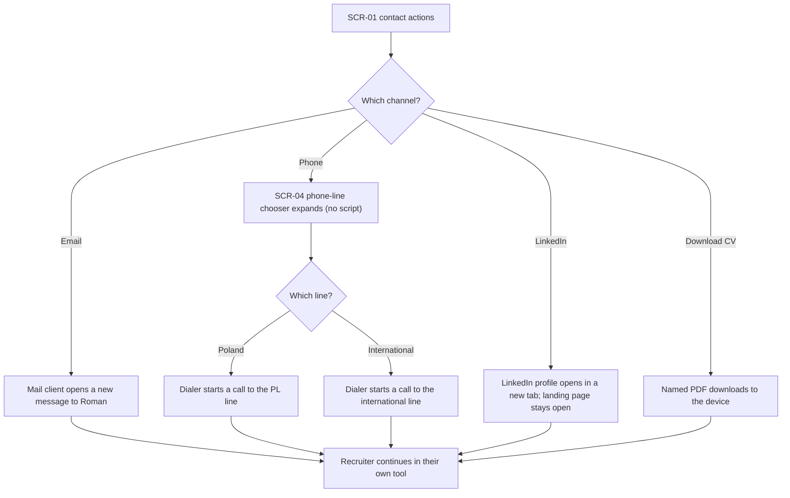
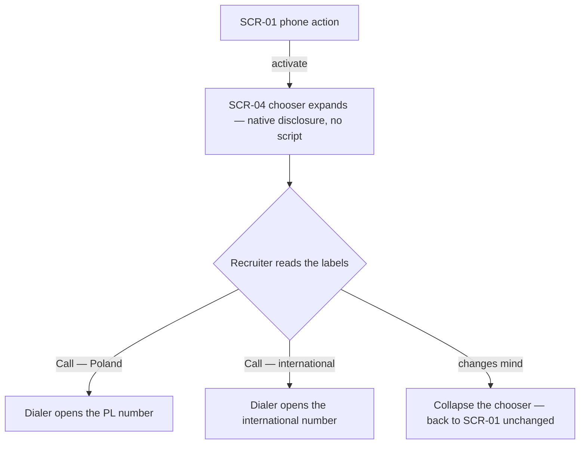
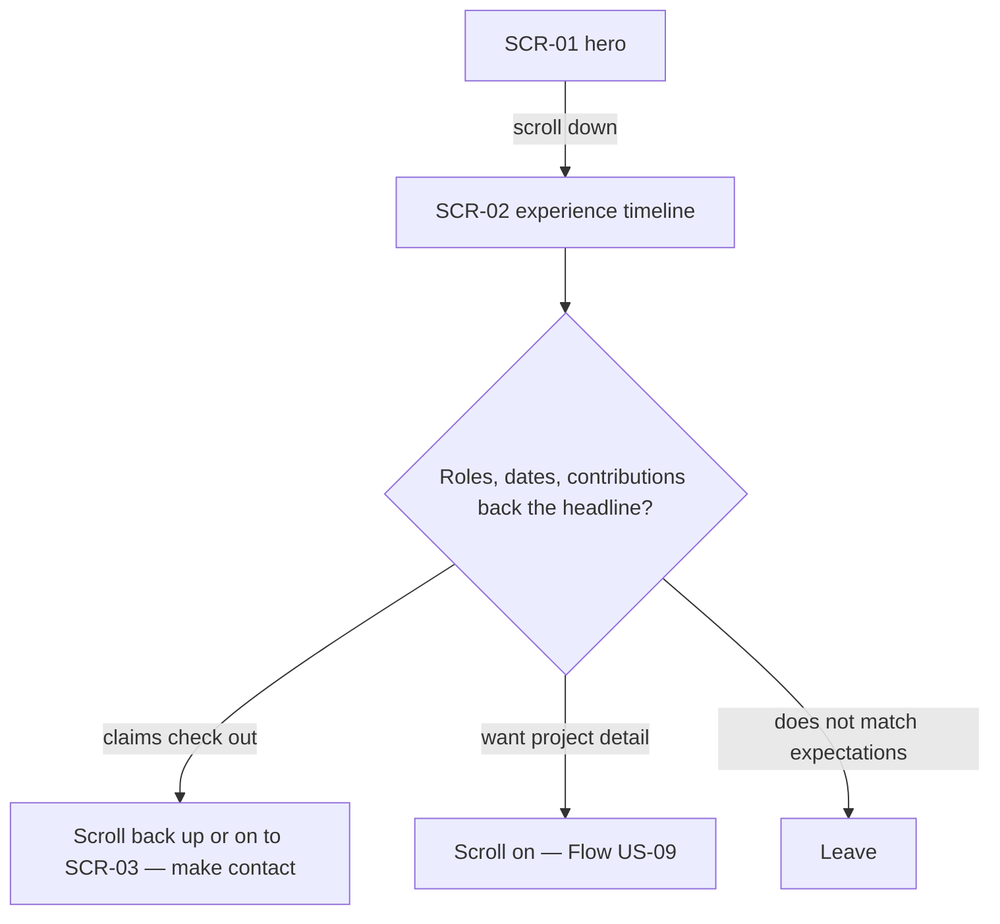
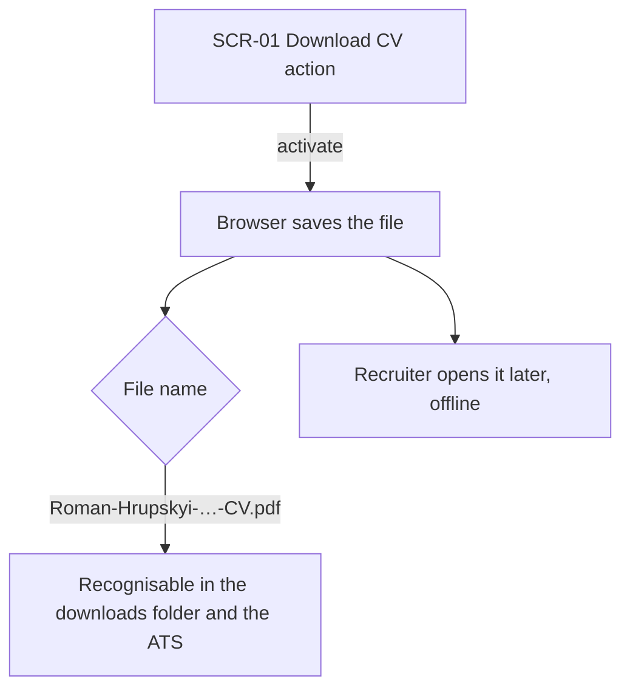
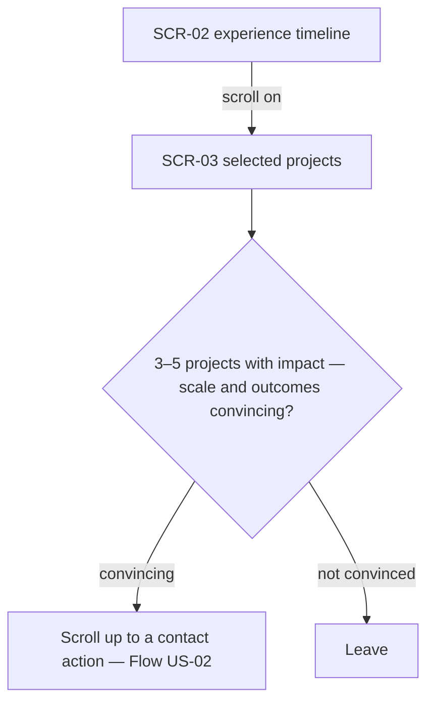

# UX flows — personal-landing

> User flows for every UI-touching §4 user story, produced by `ux-flows` (after `clarify`, before
> `design`) and read by `design` (evidence for the target-surface + UI-architecture decisions),
> `sequences`, `screens` and `plan-tests`. Markdown + mermaid `flowchart` — flow-altitude, not
> visual design.

## Platform decisions

- **Posture:** responsive, mobile-first content priority — no `docs/design-system.md` exists yet
  (run `/sdd:design-system`); assumed from `docs/architecture-map.md` (Astro static site, Tailwind,
  hand-rolled components, "~one-screen recruiter page") and the fact that the link is shared in
  outreach and CVs and is often opened first from a phone inbox. Reference viewports: 390×844
  (phone), 1280×800 (laptop).
- **Single page, no routing.** The whole feature is one document; "screens" below are sections and
  one expanded-disclosure state of that page, not separate routes. The only navigations are
  in-page scroll and four hand-offs that leave the page (mail client, dialer, LinkedIn tab, file
  download).
- **No client JavaScript.** The phone-line chooser is a native disclosure (open/close with no
  script); every other interaction is a plain link. (`design` owns the formal call; this is the
  flow-level assumption the flows are drawn against.)
- **No back-navigation to manage.** Leaving the page is always into another app/tab; the browser
  Back button returns to the page unchanged.

## Screen inventory

| ID | Screen | Purpose | Entry | Exit |
|---|---|---|---|---|
| SCR-01 | Landing hero (above the fold) | The twenty-second scan: headshot, name, headline, optional tagline, optional positioning block, availability block, top stack, four contact actions | The shared link (CV / LinkedIn / email / a labelled `/t/{label}` redirect — the redirect is roadmap step 5) | Mail client · dialer (via SCR-04) · LinkedIn tab · CV download · scroll to SCR-02 |
| SCR-02 | Experience timeline (below the fold) | Most-recent-first roles with company, date range, contribution; the single pre-2017 "earlier background" line | Scroll down from SCR-01 | Scroll to SCR-03 · scroll back to SCR-01 · leave |
| SCR-03 | Selected projects (below the fold) | Three to five flagship projects, each with name, Roman's role, and an impact statement | Scroll down from SCR-02 | Scroll back up to a contact action · leave |
| SCR-04 | Phone-line chooser (expanded state of SCR-01) | Two labelled call controls — "Call — Poland" / "Call — international" — no digits shown | Activate the phone action on SCR-01 | Dialer · collapse back to SCR-01 |

## Flows

### Flow: US-01 — Scan Roman's fit in seconds

A Recruiter opens the link Roman placed in his CV, LinkedIn, or outreach email and lands on the hero (SCR-01). Without scrolling they see the headshot, name, headline, the optional tagline and positioning block, availability block, and top stack. From that scan they either judge the fit good enough to contact Roman (into Flow US-02), decide to check his history first (scroll down into Flow US-04 / US-09), or decide it is not a fit and leave. There is no error branch in front of the Recruiter — the page is static and always renders; a missing above-the-fold essential is caught at build time (AC-05), never shown.

### Flow: US-02 — Reach Roman in one tap

From the four contact actions at the top of SCR-01 the Recruiter picks a channel. **Email** opens their mail client with a message already addressed to Roman (AC-02). **Phone** expands a no-script disclosure (SCR-04) with two labelled call controls; picking one starts a call and no phone digits are ever shown as text (AC-03, AC-10). **LinkedIn** opens Roman's profile in a new browser tab, leaving the landing page open (AC-13). **Download CV** saves the meaningfully-named PDF as a file download rather than opening it inline (AC-13, AC-04). Every branch hands the Recruiter to their own tool. On a device with no mail client or dialer the matching action may not resolve — accepted, because the rejected alternative was to print the raw value as copyable text, which breaks the actionable-only rule.

### Flow: US-03 — Choose which number to call

Activating the phone action expands a native disclosure control (SCR-04) that needs no JavaScript, so it works on any browser. The Recruiter sees one labelled control per line — "Call — Poland", "Call — international" — with no digits rendered as text, and picking one hands off to the dialer (AC-03, AC-10). Collapsing the disclosure returns them to the hero unchanged.

### Flow: US-04 — Verify the headline claims

From the hero the Recruiter scrolls to the experience timeline (SCR-02): each role most-recent-first with company, date range, and contribution, plus the single pre-2017 "earlier background" line (AC-09). If the history backs the headline they move toward contact or scroll on to the selected projects; if not, they leave. Nothing interactive — it is a read.

### Flow: US-05 — Download an identifiable CV

Activating Download CV saves the build-generated PDF whose filename is derived from Roman's name and headline — not a generic "cv" name — so it is recognisable in a downloads folder and an applicant tracking system (AC-04). The file is the same content as the page, generated by roadmap step 4; a missing PDF fails the build rather than shipping a dead action.

### Flow: US-06 — Review the page on my phone

Opening the link on a phone lands on the same SCR-01, verified at the 390×844 reference viewport: body text stays ≥16px, every contact action is a ≥44×44px tap target, and there is never horizontal scrolling at any width (AC-08). If the essentials do not all fit one phone screen the Recruiter scrolls vertically; the contact and depth flows are identical to desktop.

### Flow: US-09 — Gauge the scale and outcome of his work

Continuing past the timeline the Recruiter reaches the selected-projects section (SCR-03): three to five flagship pieces of work, each with its name, Roman's role, and a one- or two-line impact statement, quantified where a real number exists (AC-11). Every published project has a real outcome — a placeholder impact fails the build (AC-12). Convinced, the Recruiter scrolls back up to a contact action; unconvinced, they leave.

## Out of scope (backend / authoring — no screens)

- **US-07 — Publish by committing one file.** Roman edits the Profile content entry, commits, and CI builds and deploys the site. No application screen — a git + CI flow.
- **US-08 — Never ship a broken page.** The build validates the required Profile fields and fails with a message naming the missing or malformed one (AC-05, AC-06, AC-12). Roman or CI sees a build log, not a UI screen.

## AC coverage

| AC | Shown by | Notes |
|---|---|---|
| AC-01 | Flow US-01 → SCR-01, decision "twenty-second scan" | The above-the-fold scan itself |
| AC-02 | Flow US-02 → "Email" branch | Mail client opens addressed to Roman |
| AC-03 | Flow US-02 → "Phone" → SCR-04; Flow US-03 | Labelled call controls, no digits as text |
| AC-04 | Flow US-05 → "File name" decision; Flow US-02 → "Download CV" | Filename derivation is build-time (step 4); the flow shows the download UX |
| AC-05 | — | N/A: build-time gate, no Recruiter-facing screen (see Out of scope, US-08) |
| AC-06 | — | N/A: build-time, Roman/CI-facing, no screen |
| AC-07 | Flow US-02 → SCR-01 / SCR-04 | Contact only via controls; the "not in delivered source" part is a source-inspection property, not a flow |
| AC-08 | Flow US-06 | Legibility, tap-target size, no horizontal scroll at the phone viewport |
| AC-09 | Flow US-04 → SCR-02 | Timeline roles + the "earlier background" line |
| AC-10 | Flow US-02 → SCR-04; Flow US-03 | Contact details actionable-only on the page |
| AC-11 | Flow US-09 → SCR-03 | 3–5 projects with impact statements |
| AC-12 | — | N/A: build-time gate, no screen |
| AC-13 | Flow US-02 → "LinkedIn" and "Download CV" branches | New tab / file download |
