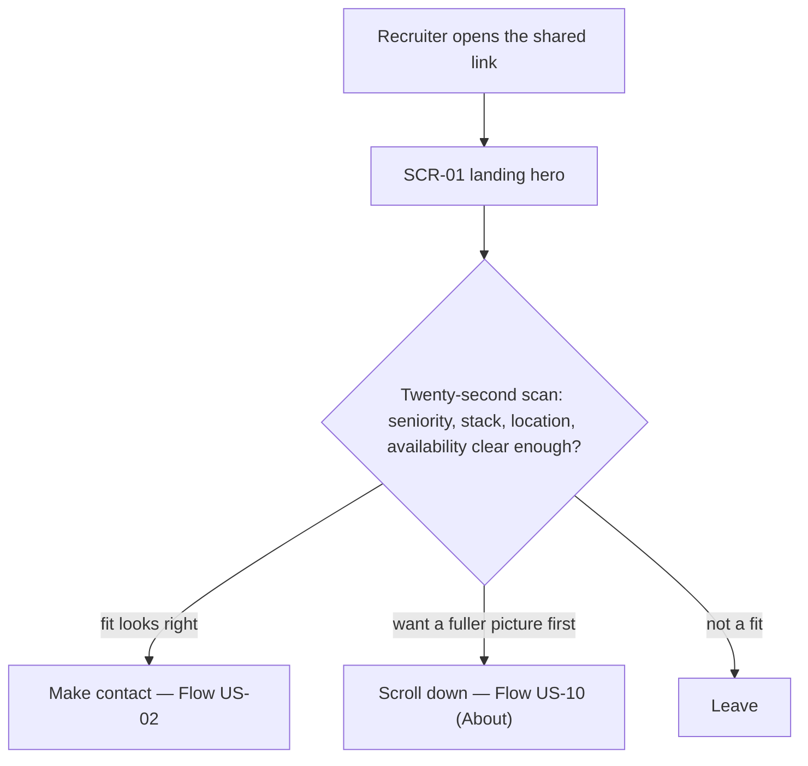
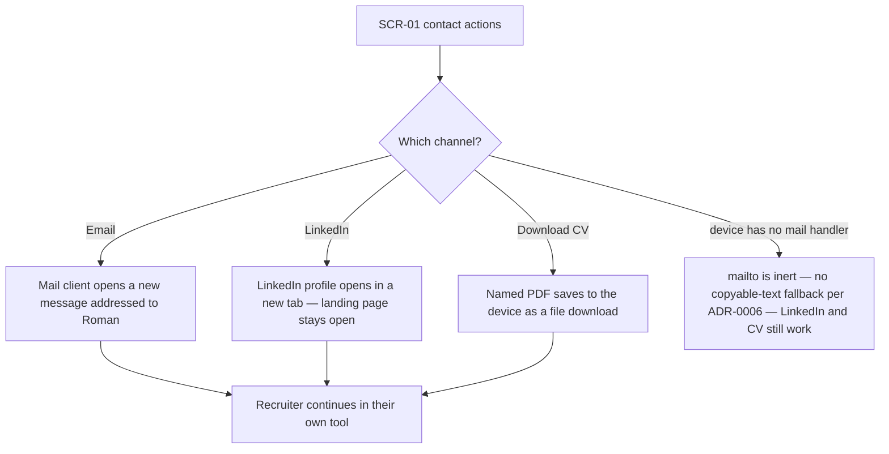
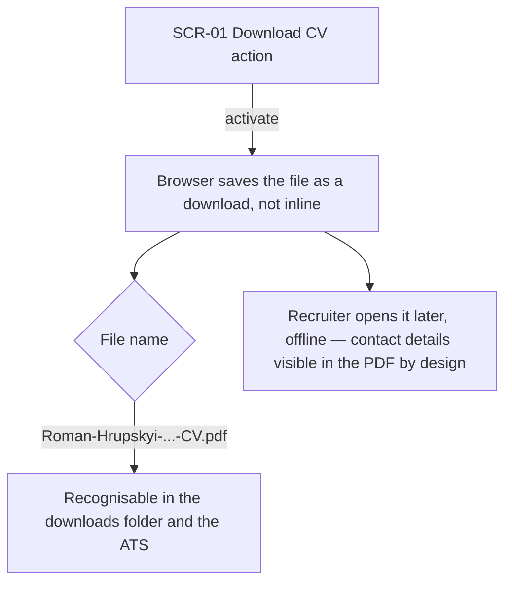
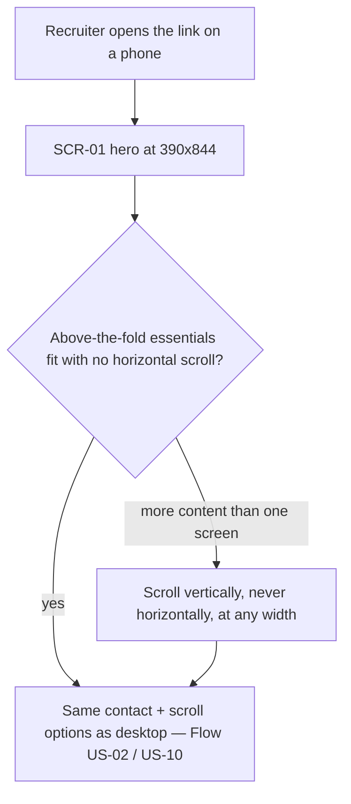
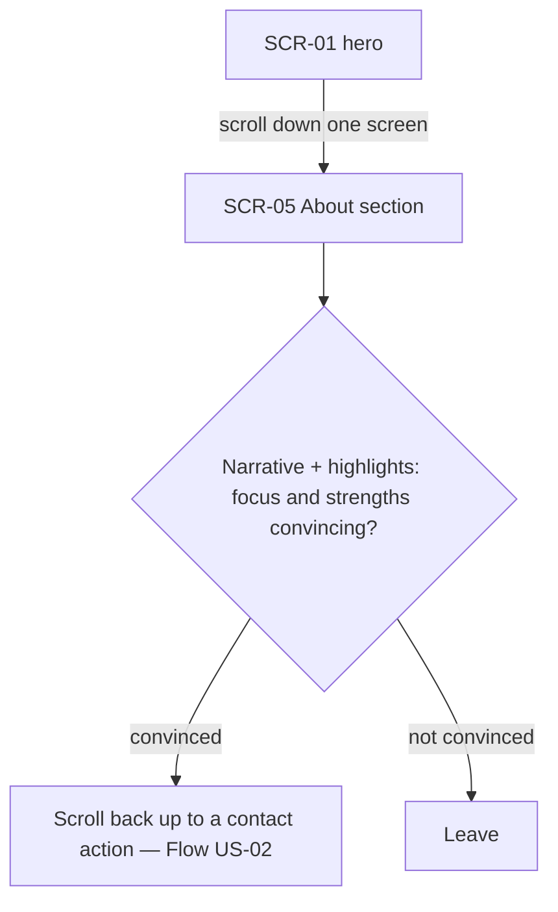

# UX flows — personal-landing

> User flows for every UI-touching §4 user story, produced by `ux-flows` (after `clarify`, before
> `design`) and read by `design` (evidence for the target-surface + UI-architecture decisions),
> `sequences`, `screens` and `plan-tests`. Markdown + mermaid `flowchart` — flow-altitude, not
> visual design.
>
> **Re-synced 2026-09-07** to the current spec: below-the-fold depth cut to v2 (US-04 / US-09);
> the phone control removed from the landing page entirely (US-03 / AC-03 withdrawn — not
> deferred); a short **About section** added below the fold (US-10 / AC-14). Contact actions are
> now three: email, LinkedIn, Download CV.

## Platform decisions

- **Posture:** responsive-both — from `docs/design-system.md` (§Platform posture): recruiters open
  the link from a phone inbox (outreach, CV footers) and from a laptop while writing up a
  candidate, so neither viewport is a second-class reflow of the other. Two fixed reference
  viewports: **390×844** (phone) and **1280×800** (laptop); no horizontal scroll at any width
  between them (and at 360 / 768 / 1920, §6 NFR).
- **Single page, two sections, no routing.** The whole feature is one document: the **hero**
  (above the fold) and the **About section** (one scroll below it). "Screens" below are those two
  sections of the page, not separate routes. The only navigations are in-page vertical scroll and
  three hand-offs that leave the page (mail client, LinkedIn tab, file download).
- **No client JavaScript.** Every interaction is a plain link or a scroll. (The old no-script
  phone-line disclosure is gone with the phone control.) `design` owns the formal call; this is
  the flow-level assumption the flows are drawn against.
- **No back-navigation to manage.** Leaving the page is always into another app/tab; the browser
  Back button returns to the page unchanged.

## Screen inventory

| ID | Screen | Purpose | Entry | Exit |
|---|---|---|---|---|
| SCR-01 | Landing hero (above the fold) | The twenty-second scan: headshot, name, headline, optional tagline, optional positioning block, availability block, top stack, three contact actions (email · LinkedIn · Download CV) | The shared link (CV / LinkedIn / email / a labelled `/t/{label}` redirect — the redirect is roadmap step 5) | Mail client · LinkedIn tab · CV download · scroll to SCR-05 |
| SCR-05 | About section (below the fold) | A short prose `narrative` + a `highlights` bullet list, both rendered straight from Profile content — a fuller sense of Roman's focus in his own words | Scroll down from SCR-01 | Scroll back up to a contact action · leave |

**Retired ids (kept, not reused):** `SCR-02` (experience timeline) and `SCR-03` (selected
projects) are **v2**; `SCR-04` (phone-line chooser) was **removed** with US-03. `SCR-05` keeps the
number `screens` already drew the About artboard under.

## Flows

### Flow: US-01 — Scan Roman's fit in seconds

A Recruiter opens the link Roman placed in his CV, LinkedIn, or outreach email and lands on the
hero (SCR-01). Without scrolling they see the headshot, name, headline, the optional tagline and
positioning block, the availability block, the top stack, and the three contact actions. From that
scan they either judge the fit good enough to contact Roman (into Flow US-02), scroll down to read
the About section first (Flow US-10), or decide it is not a fit and leave. There is no error branch
in front of the Recruiter — the page is static and always renders; a missing required field is
caught at build time (AC-05), never shown.

### Flow: US-02 — Reach Roman in one tap

From the three contact actions at the top of SCR-01 the Recruiter picks a channel. **Email** opens
their mail client with a message already addressed to Roman (AC-02). **LinkedIn** opens Roman's
profile in a new browser tab, leaving the landing page open (AC-13). **Download CV** saves the
meaningfully-named PDF as a file download rather than opening it inline (AC-13, AC-04). The email
address and the LinkedIn URL never appear as visible text — they live only in the controls' link
attributes (AC-07, AC-10); the phone is not on the landing page at all in v1. On a device with no
mail client the `mailto:` activation is simply inert — accepted, because the rejected alternative
was to print the raw value as copyable text, which breaks the actionable-only rule; LinkedIn and
the CV download cover that case.

### Flow: US-05 — Download an identifiable CV

Activating Download CV saves the PDF whose filename is derived from Roman's name and headline
through the shared filename helper — not a generic "cv" name — so it is recognisable in a downloads
folder and an applicant tracking system (AC-04). In v1 the file is a **committed static PDF** under
`site/public/` (the reconciled "Classic" variant — ADR-0008), not generated from `/cv`; a missing
file fails the build rather than shipping a dead action. The download is the one place a Recruiter
sees Roman's full contact details, and they initiate it deliberately.

### Flow: US-06 — Review the page on my phone

Opening the link on a phone lands on the same SCR-01, verified at the 390×844 reference viewport:
body text stays ≥ 16 px, every contact action is a ≥ 44×44 px tap target, and there is never
horizontal scrolling at any width (AC-08). If the essentials do not all fit one phone screen the
Recruiter scrolls vertically; the contact and About flows are identical to desktop. At 360 px only
the no-horizontal-scroll guarantee is binding — optional elements (positioning block → tagline →
top-stack wrap) may drop below the fold in that order (§6).

### Flow: US-10 — Read a short "about" in Roman's own words

One scroll below the fold the Recruiter reaches the About section (SCR-05): a short prose narrative
(reconciled from `docs/reference/linkedin-about.md`) and a highlights bullet list (Roman's own
text), both rendered straight from the Profile content — no hard-coded copy (AC-14). Both fields
are build-required; a missing narrative or an empty highlights list fails the build (AC-05, AC-06),
never ships blank. On the phone viewport the section reflows to a single column, body text ≥ 16 px,
no horizontal scroll. Nothing interactive — it is a read; convinced, the Recruiter scrolls back up
to a contact action, otherwise they leave.

## Out of scope

### Removed from v1 (not deferred)

- **US-03 — Choose which number to call.** The phone is not a landing-page channel in v1 — no
  `tel:` control, no line chooser, no phone value in the delivered HTML. `contact.phones` stays in
  the Profile content and renders only on the CV route. AC-03 withdrawn. (`SCR-04` retired.)

### Deferred to v2

- **US-04 — Verify the headline claims** (experience timeline, `SCR-02`, AC-09). In v1 a Recruiter
  verifies history via the committed CV.
- **US-09 — Gauge the scale and outcome of his work** (selected projects, `SCR-03`, AC-11 / AC-12).

### Backend / authoring — no screens

- **US-07 — Publish by committing one file.** Roman edits the Profile content entry, commits, and
  CI builds and deploys the site. No application screen — a git + CI flow.
- **US-08 — Never ship a broken page.** The build validates the required Profile fields (including
  `about.narrative` + `about.highlights`) and fails with a message naming the missing or malformed
  one (AC-05, AC-06). Roman or CI sees a build log, not a UI screen.

## AC coverage

| AC | Shown by | Notes |
|---|---|---|
| AC-01 | Flow US-01 → SCR-01, decision "twenty-second scan" | The above-the-fold scan itself; three contact actions |
| AC-02 | Flow US-02 → "Email" branch | Mail client opens addressed to Roman |
| AC-03 | — | WITHDRAWN with US-03 (phone removed from v1) |
| AC-04 | Flow US-05 → "File name" decision; Flow US-02 → "Download CV" | Filename derivation is build-time; the flow shows the download UX. Committed static PDF in v1 (ADR-0008) |
| AC-05 | — | N/A: build-time gate, no Recruiter-facing screen (see Out of scope, US-08). Now also covers `about.narrative` / `about.highlights` |
| AC-06 | — | N/A: build-time, Roman/CI-facing, no screen |
| AC-07 | Flow US-02 → SCR-01 | Contact only via controls; phone absent entirely; the "not in delivered source" part is a source-inspection property, not a flow |
| AC-08 | Flow US-06 | Legibility, tap-target size, no horizontal scroll at the phone viewport |
| AC-09 | — | WITHDRAWN with US-04 (deferred to v2) |
| AC-10 | Flow US-02 → SCR-01 | Email + profile URL actionable-only on the page |
| AC-11 | — | WITHDRAWN with US-09 (deferred to v2) |
| AC-12 | — | WITHDRAWN with US-09 (deferred to v2) |
| AC-13 | Flow US-02 → "LinkedIn" and "Download CV" branches | New tab / file download |
| AC-14 | Flow US-10 → SCR-05 | About renders narrative + highlights from Profile content; reflows to one column on phone |
