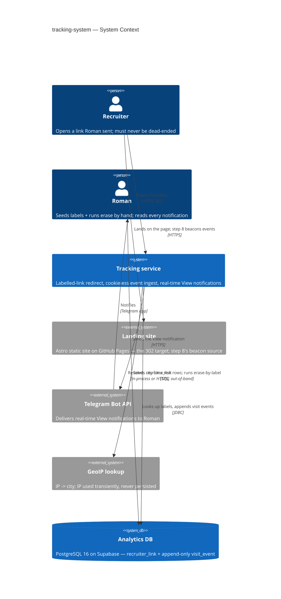
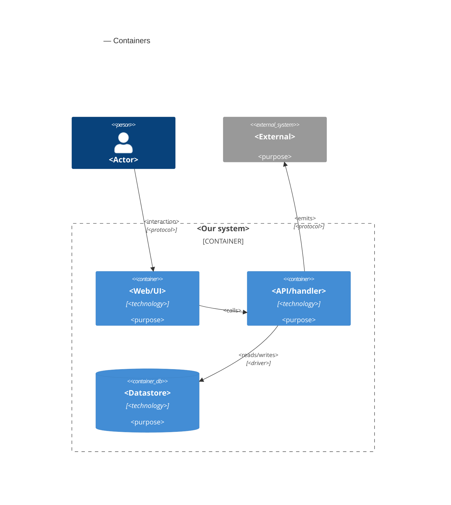

# Software Architecture Document — tracking-system

<!-- 12 Arc42 sections. C4 Context (L1) inline in §3, C4 Container (L2) inline in §5.
     Numbers in §10 come VERBATIM from spec.md §6 NFR. -->

## 1. Introduction and goals

**Intent.** Add the tracking behaviour (roadmap steps 5–7) to the existing `tracker/` Spring Boot service: a **labelled-link redirect** (`GET /t/{label}` → `302` to `https://<site>/?r=<label>`), a **cookieless event-ingest endpoint** (`POST /e` for page-view / contact-action / cv-download events posted by roadmap step 8's future browser beacon), and a real-time Telegram **View notification** for every genuine **Visit** *and* every engagement event. Labels are short URL-safe slugs Roman seeds by hand (one `recruiter_link` row per outreach) — there is no label-creation endpoint or admin UI. Visit history is retained indefinitely, offset by a manual, Roman-only **erase-by-label** operation. Both public endpoints carry a per-source rate limit as the sole abuse guardrail. This feature owns the redirect + ingest + notify behaviour and the `?r=<label>` on the redirect target; the browser code that reads `?r=`, retains it, and scrubs the URL is roadmap step 8 (a separate `site/` feature, out of scope here).

**Top-3 quality goals (1-liners; full scenarios in §10):**

1. **Redirect responsiveness on the recruiter click path** — p95 ≤ 100 ms (request received → 302 returned), redirect availability ≥ 99% monthly; no heavy work before the 302.
2. **Notification signal integrity** — exactly one View notification per genuine Visit and one per engagement event (no batching, no dedup of repeats), delivered p95 ≤ 5 s; recognized link-preview crawlers never record or notify; fire-and-forget — a failed send is logged, never retried, and never blocks recording.
3. **Privacy / data-protection posture** — the raw IP is never persisted to the visit store or any durable history (only the derived city); erase-by-label removes every row for a label; the endpoints are unauthenticated by design and the only abuse guardrail is the per-source rate limit.

**Stakeholders.**

| Role | Interest | Sign-off owner? |
|---|---|---|
| Roman | Seeds `recruiter_link` rows; runs erase-by-label; receives every View notification; reads visit history out-of-band | Yes |
| Recruiter | Opens labelled / plain links; must never be dead-ended by a bad label or a throttle | No |
| Tech Lead (Roman) | SAD approval | Yes |
| Security reviewer | The §6.1-required review of the erase operation and the rate limit before this SAD's ADRs finalize | Yes |

<!-- Decision overrides (¶4) — none. -->

## 2. Constraints

**Technical (fixed).**
- Java 21; Spring Boot 3.5.5; Maven (wrapper `./mvnw`).
- Spring Web MVC; **Spring Data JDBC** (no JPA/Hibernate); Flyway; PostgreSQL 16 (Supabase, free tier); Spring `RestClient` for the Telegram Bot API.
- Package layout `com.grupskyi.tracker` → `web` (controllers) / `app` (services) / `infra` (JDBC repos, Telegram client) / `domain` (records); **constructor injection only**; components discovered by scan.
- Runtime: **one always-warm Fly.io `shared-cpu-1x` machine in `waw`**, `min_machines_running = 1` — load-bearing for the ≤ 100 ms redirect NFR; no scale-to-zero, no cold JVM on a recruiter's click path.

**Technical (assumptions — flagged, with fallbacks).**
- **Supabase project region: EU-central (Frankfurt)**, ~10–25 ms RTT from `waw`; a single-row `INSERT` is budgeted at p95 ≤ 30 ms. → If the real project is trans-Atlantic, the §4 decision to write the visit row *synchronously before the 302* flips to fully-async recording. Carried as a §11 risk row.
- Supabase free tier pauses a project after ~7 days of inactivity — the first request after a pause misses the redirect NFR. Accepted at personal scale (an `architecture-map.md` constraint); the always-warm machine's own DB touches keep the project from idling in practice.

**Organisational.**
- Solo developer (Roman); personal-scale project; no fixed external deadline — "ship this week beats ship complete".
- Bundles roadmap steps 5 (M) + 6 (M) + 7 (S) into one feature; stays **M** — no breaking changes (nothing consumes this service yet), the module + conventions are already scaffolded.

**Conventions.**
- `CLAUDE.md` + `docs/architecture-map.md §Conventions`.
- `visit_event` is **append-only** — no `UPDATE`/`DELETE` code path in the application.
- One `@RestControllerAdvice` → `{ "error": <code>, "message": <text> }`.
- Event-ingest endpoints are **fire-and-forget**: a DB/logging failure is logged server-side and still returns `202`, never a `5xx` to the browser.
- IDs: `visit_event.id` = `bigint generated always as identity`; ordering by `created_at timestamptz default now()`; `recruiter_link.label` is a human-chosen slug and the PK.
- Migrations: Flyway `V<n>__<snake_case>.sql`, forward-only, each small and reversible-by-hand.
- Tests: JUnit 5. Unit = plain classes. Integration = `@SpringBootTest` + Testcontainers Postgres (extend `AbstractIntegrationTest`).

**Regulatory / external.**
- **GDPR** — a Labelled link's label may name a real, identifiable person; the data is classified **confidential** (spec §6.1).
- **Retention:** indefinite, offset by the manual Roman-only erase-by-label operation — no automatic expiry policy (resolves roadmap open decision D6; spec §3).
- **Security review Required** (spec §6.1) — a new store of personal data plus a destructive manual operation; the review lands before this SAD's erase + rate-limit ADRs finalize.
- Accepted residual: already-delivered Telegram messages and label occurrences in rotating server logs are outside the erase operation's reach (spec §6.1 / AC-08).

## 3. Context and scope

The tracker sits between a Recruiter's browser and Roman's Telegram: it turns "I sent a recruiter a link" into "I know she opened it, when, roughly from where, and what she did." It exposes two **unauthenticated public endpoints** by design — the labelled-link redirect and the event-ingest path — so any recruiter can use them with no friction; the one privileged capability (erase-by-label) is not reachable on any public path.

<!-- brownfield: `tracker/` Spring Boot service scaffolded (commit b1583df) — TrackerApplication, HealthController (/healthz), Flyway V1__init.sql (recruiter_link, visit_event: id/link_label/kind/city/referrer/user_agent/created_at), application.yml with telegram.bot-token + chat-id placeholders, Testcontainers harness (AbstractIntegrationTest). This feature adds redirect + ingest + notify on that skeleton; no existing behaviour changes. -->

**Trust boundary.** Everything arriving from a browser is untrusted: the `{label}` path segment, request headers (`User-Agent`, `Referer`), and every `/e` request body. A label is validated against `recruiter_link` before it is forwarded — an unmatched label is **not** put on the redirect target (AC-04). Event bodies are recorded **without** verifying that the claimed label or Visit genuinely exists — a deliberate, accepted trade-off at this scale; the per-source rate limit is the only defence (spec §6.1).

**External systems (in / out):**

| Actor or system | Type | Interaction |
|---|---|---|
| Recruiter | Person (external, untrusted) | Opens `/t/{label}` (receives a 302); via step 8's future beacon, triggers `/e` events |
| Roman | Person (internal) | Seeds `recruiter_link` rows by hand; runs erase-by-label by hand (out-of-band); receives every View notification |
| Landing site (`site/`, GitHub Pages) | System (internal, sibling feature) | The 302 target (`https://<site>/?r=<label>`); roadmap step 8's inline script will POST events to `/e` — step 8 is out of scope here |
| Telegram Bot API | System (external) | Receives HTTPS `sendMessage` calls; delivers View notifications to Roman's chat |
| GeoIP lookup | System (external service *or* bundled dataset — §4 decision) | Maps a request IP → city; the IP is used transiently and never persisted (AC-12) |
| Supabase PostgreSQL 16 | System (external, managed) | The visit store; Flyway migrations run on tracker boot |

**C4 Context (L1):**



## 4. Solution strategy

<!-- 🎯 Why: the 3–4 STRATEGIC PILLARS every ADR grows from. Without §4 each ADR looks random —
     there's no umbrella. ⭐ The densest section — the blast-radius gate fires almost always here
     (decisions are irreversible + multi-module).
     📋 Write: 3–4 choices; each a heading + 2–3 sentences of rationale.
     📌 «Store content as a table of typed blocks» is a pillar — ADR-0001 grows from it. -->

**Top strategic choices (the seeds for ADRs):**

1. **<e.g. Module isolation through events>** — <2–3 sentences citing quality goals + constraints>.
2. **<e.g. Single-store persistence>** — <2–3 sentences>.
3. **<e.g. Server-rendered read side>** — <2–3 sentences>.

Each tactical decision in later sections should trace to one of these seeds. Tactical decisions that *contradict* a strategic choice are red flags — surface them in §11.

## 5. Building block view

<!-- 🎯 Why: INTERNAL DECOMPOSITION — modules, containers, datastores. The static topology: who
     may talk to whom. Without §5, §6 (the flows) has no vocabulary of participants.
     📋 Write: 1 ¶ on the style (layered / hexagonal / clean / event-driven) + a folder tree + a
     C4Container block.
     📌 Draw ONE Container per declared `target_surface` (frontmatter): a fullstack
     [backend-service, web-frontend] = a backend-API container + a web/SPA container; a
     [backend-service, mobile-app] = the API + the mobile app. The Container(web, …) line below is
     just one surface's container — swap/add per what was declared in §4. → _shared/surfaces.md
     📌 e.g. «web app, content API, media worker, datastore, object store, CDN». -->

<One paragraph: layered / hexagonal / clean / event-driven, and why.>

**Internal decomposition:**

```
<e.g. modules/<feature>/>
├── domain/       <entities + sentinel errors>
├── app/          <use cases / services>
├── infra/        <repository + integration impl>
├── ports/        <handlers, DTOs, error mapping>
└── wiring        <self-wiring entry point>
```

**C4 Container (L2):** <!-- syntax → references/c4-mermaid-syntax.md. Real names, no <placeholder> stubs. ONE Container per declared target_surface (frontmatter); the web container below is one example surface. -->



## 6. Runtime view

<!-- 🎯 Why: the RUNTIME FLOW of 1–2 critical scenarios — who talks to whom, when, in what order.
     Without §6, §5 is just boxes with no life.
     📋 Write: a Mermaid sequenceDiagram. Participants are names from §5 (don't invent new ones).
     Messages are semantic («saves a draft»), NO HTTP verbs / paths / status codes — endpoint-level
     sequences arrive at the `api` stage.
     📌 e.g. «author → web: composes draft → web → content API: save». Seed the primary flow(s) here;
     the `sequences` stage then covers every §5 AC (no cap). Never N/A for M+; XS/S keeps ≥1 happy-path flow. -->

**Critical flow 1: <flow name>**

```mermaid
sequenceDiagram
    actor Actor
    participant Web
    participant Service
    participant Store
    Actor->>Web: <action>
    Web->>Service: <call>
    Service->>Store: <write>
    Store-->>Service: ok
    Service-->>Web: result
    Web-->>Actor: confirmation
```

**Critical flow 2: <e.g. async event propagation>** — <if applicable, otherwise N/A>.

## 7. Deployment view

<!-- 🎯 Why: the TOPOLOGY DevOps must know without reading the deploy charts — how many replicas,
     where the background worker lives, AT WHAT NUMBERS we scale.
     📋 Write: 2–3 sentences on topology + monitoring + concrete threshold numbers.
     📌 e.g. «500 authors → partition by quarter» (not «we'll think about scale later»).
     🎯 N/A allowed for XS/S that reuses an existing deployment unit with no change.
     Deployment-diagram scaffold → templates/deployment.md. -->

<Topology in 2–3 sentences. Where it runs, replicas, scaling thresholds.>

**Monitoring:**
- <Metrics — e.g. `<metric_name>`>
- <Alerts — e.g. «worker lag > 10 min → page on-call»>
- <Tracing — e.g. spans on the request boundary>

**Scaling thresholds:**
- <e.g. comfortable in one table up to N rows/year>
- <e.g. partition by quarter above N rows/year>

<!-- For XS/S with no deployment change: <!-- N/A: reuses existing deployment unit, no infra change --> -->

## 8. Crosscutting concepts

<!-- 🎯 Why: CROSS-CUTTING PATTERNS spanning several modules: logging, errors, authorization, ID
     strategy, events, caching. ⭐ The second-densest section. A pattern inside one module is NOT
     here; a project-wide convention belongs in the convention file.
     📋 Write: a table — concept / convention / where defined. One row per concept.
     📌 e.g. «sortable time-based IDs generated in the app layer» as a default from the convention file. -->

| Concept | Convention | Where defined |
|---|---|---|
| Logging | <e.g. structured, fields `module=<name>`> | <convention file §X or here> |
| Authentication | <e.g. token-based via middleware> | <convention file §X> |
| Error handling | <e.g. domain sentinel → ports error mapping → JSON> | <convention file §X> |
| ID strategy | <e.g. sortable time-based ID in the app layer> | <convention file §X> |
| Internationalisation | <e.g. N/A, single language> | — |
| Observability | <e.g. tracing on the request boundary> | — |
| Events | <module-specific patterns, if any> | <here> |

## 9. Architecture decisions

<!-- 🎯 Why: the REVERSE INDEX onto the adr/ folder. `ls adr/` gives the files; §9 gives the
     semantics — why they exist, which SAD section they attach to, what status.
     📋 Write: a 4-column table, one row per ADR. Mixed status is fine.
     📌 e.g. «0001 | Store content as a table of typed blocks | Accepted | §4». -->

| # | Title | Status | Section |
|---|---|---|---|
| <NNNN> | <imperative — e.g. "Use a sliding-window counter for rate limiting"> | Accepted | §<N> |
| <NNNN> | <imperative — e.g. "Co-locate the worker in the API process"> | Accepted | §<N> |

ADR files live under `docs/features/<slug>/adr/NNNN-<title>.md`.

## 10. Quality requirements

<!-- 🎯 Why: the QUALITY TREE — take a goal from §1 and break it into concrete leaves: tests,
     metrics, configs, drills. ⭐ Without §10, §1 is a manifesto. With §10 each declaration maps
     to something PROVABLE.
     📋 Write: per §1 goal — When / Then / How-verify. Numbers from spec §6 NFR VERBATIM (don't
     round ≤250ms to ≤300ms — that's a critic F6 hit).
     📌 e.g. «p95 ≤ 500 ms on a block update, verified by a 100 req/s load test». -->

Each top-3 goal from §1 expanded into a full scenario:

**QG-1. <quality attribute>**
- **When:** <trigger condition>
- **Then:** <expected behaviour with numbers from spec §6 NFR>
- **How verify:** <test / chaos drill / load test / metric>

**QG-2. <quality attribute>**
- **When:** <trigger>
- **Then:** <expected>
- **How verify:** <how>

**QG-3. <quality attribute>**
- **When:** <trigger>
- **Then:** <expected>
- **How verify:** <how>

## 11. Risks and technical debt

<!-- 🎯 Why: ⭐ collects EVERYTHING that can break — not only the technical. Without §11 risks get
     discussed at standups and lost; debt lives only in the head of whoever accepted it.
     📋 Write: a risk/debt table — severity — mitigation — owner. Accepted debt in its own block.
     📌 The first risk is often a product risk, not a technical one. That's normal. -->

<!-- Severity literals: Low / Medium / High for regular risks; "Open question" for rows created by
     a Save-as-OQ resolution during the Socratic walk (see references/socratic.md). -->

| Risk / debt | Severity | Mitigation | Owner |
|---|---|---|---|
| <e.g. Worker lag may reach hours during a downstream outage> | Medium | <alert >10 min, on-call playbook, retry backoff> | <DevOps> |
| <e.g. No event-schema versioning in v1> | Medium | <ADR-NNNN planned for v2, tolerate unknown fields> | <Backend> |
| Open architectural decision: <decision-headline> | Open question | Resolve before <stage trigger or YYYY-MM-DD>; <inline rationale from the Save-as-OQ> | <owner> |

**Accepted debt (acceptable in v1, plan to fix later):**
- <e.g. the entity is immutable / unversioned — OK for v1, may need audit versioning in v2>

## 12. Glossary

<!-- 🎯 Why: ⭐ the DOMAIN GLOSSARY that ends arguments a year later («checkpoint — weekly or
     biweekly? quarter — calendar or fiscal?»).
     📋 Write: a term / meaning table. Business + technical terms mixed.
     📌 e.g. «Lesson | a unit inside a course made of blocks (text, video)». -->

| Term | Meaning |
|---|---|
| <e.g. domain object A> | <its meaning in this domain> |
| <e.g. domain object B> | <its meaning> |
| <e.g. domain invariant name> | <the rule, in plain language> |
