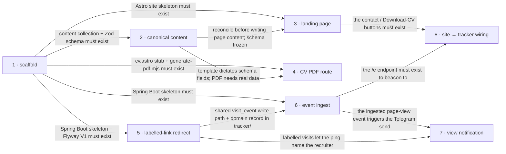

# Roadmap — personal-landing

> **A decomposition, not a promise.** The overall idea broken into incremental steps: what each
> step is, where it comes from, how big it is — or that nobody has looked at it yet — and in which
> order, and parallel lanes, we walk them. **No dates** (except shipped history), **no scores** —
> order is the prioritization. The *solution* for any step lives in its `docs/features/<slug>/`
> spec, not here.

## Destination

A recruiter opens one link, judges Roman's fit in ~10 seconds, taps to call / email / connect / download the CV, and Roman gets a real-time Telegram ping plus a per-recruiter visit log — all from a static site and one small tracker, both auto-deploying on commit.

## Steps

| # | Step | Source | Size | Status |
|---|---|---|:---:|---|
| 1 | Scaffold the skeleton — monorepo, Astro site + Tailwind v4 + typed `profile` collection, Spring Boot tracker + Flyway V1, CI/deploy workflows, build-time PDF generator | `architecture-map.md` §Module inventory + `docs/features/_scaffold/tasks.json` | M | idea |
| 2 | Canonical profile content — reconcile surname / employment dates / years-of-experience / iGaming framing / the 2004→2017 period into one content-collection entry; lock the Zod schema to the reference template's sections | `idea-brief.md §2 Problem` + `idea-brief.md §6 Risks` + `idea-brief.md §8 Open questions` | S | idea |
| 3 | Recruiter landing page — `index.astro`: name, one-line positioning, availability block, top stack, above-the-fold contact actions (phone / email / LinkedIn / Download CV); experience, selected projects, recommendations below the fold; the shared `Section` / `ContactButton` / `AvailabilityBlock` / `ProjectCard` primitives | `idea-brief.md §7 Recommendation` + `idea-brief.md §3 Users` | L | idea |
| 4 | CV PDF route — `cv.astro` as a faithful reproduction of `docs/reference/cv-template-reference.pdf`, fed by the same `profile` collection; meaningfully-named PDF emitted at build | `architecture-map.md §Stack` (PDF generation) + `docs/adr/0004` | M | idea |
| 5 | Labelled-link redirect — `/t/{label}` → 302 to the site, appends a visit event; `recruiter_link` rows seeded by hand, one per outreach | `idea-brief.md §7 Recommendation` + `idea-brief.md §5 Out of scope` | M | idea |
| 6 | Cookieless event ingest — `/e` endpoint: page-view, contact-click (per channel), `cv_download`; city / referrer derivation; append-only | `idea-brief.md §7 Recommendation` | M | idea |
| 7 | View notification — Telegram "page viewed" message to Roman on every visit; a labelled visit names the recruiter, an unlabelled one carries city / referrer | `idea-brief.md §7 Recommendation` + `architecture-map.md §Stack` (Notifications) | S | idea |
| 8 | Site → tracker wiring — the inline `<script>` that beacons page-view + contact-click + `cv_download` to `/e`; the CV download proceeds regardless of the beacon (fire-and-forget) | `architecture-map.md §Frontend / UI foundation` (State / data-fetching) + `idea-brief.md §7 Recommendation` | S | idea |
| 9 | Per-recruiter "why I fit you" intro → see [Not yet specified](#not-yet-specified) | `idea-brief.md §6 Risks` | fog | idea |

## Not yet specified

| Area | What we'd have to learn | Blocks | How it gets sharpened |
|---|---|:---:|---|
| Per-recruiter "why I fit you" intro | Whether the intro is URL-param driven or tied to the `recruiter_link` label; whether its text lives in the content collection, in the tracker, or in the link query string; how it renders without flashing default content on a static page; whether it is even in v1 at all | 9 | A conversation with Roman, then a recon pass once the shape is chosen |

## Out of scope

- Browser-based admin panel / content-management UI — deferred to a later, separate feature; v1 content is file + git (`idea-brief.md §5`).
- Identifying anonymous visitors by name or company — not achievable on a public URL; "who" comes only from self-labelled per-recruiter links (`idea-brief.md §5`).
- Blog / articles / long-form writing — not what the ten-second scan needs (`idea-brief.md §5`).
- Multiple language versions — English-only for v1; the schema and templates stay locale-clean so it is additive later (`idea-brief.md §5`, `architecture-map.md §Constraints`).
- Search-engine optimisation — traffic comes from links Roman sends, not search (`idea-brief.md §5`).
- Reshaping the CV layout — `cv.astro` is locked to `docs/reference/cv-template-reference.pdf`; only the section data changes (`architecture-map.md §Constraints`).

## Open decisions

| # | Question | Type | Owner | Blocks |
|---|---|:---:|:---:|:---:|
| D1 | Which surname spelling is canonical — Hrupskyi / Grupskyi / Grupskiy? | grilling | human | 2 |
| D2 | Which CV variant is the content base — the three-page "Classic" version or the reference template? | grilling | human | 2 |
| D3 | How is the iGaming / EveryMatrix experience framed for gambling-averse employers? | grilling | human | 2 |
| D4 | What are the corrected employment dates, and how is the 2004→2017 sales / project-management period presented — shown, summarised, or omitted? | grilling | human | 2 |
| D5 | Is salary or rate expectation shown on the page? | grilling | human | 3 |
| D6 | Is informal storage of named-recruiter visit logs acceptable as-is, or is a retention / notice line needed? | grilling | human | 5 |
| D7 | Which contact channel is primary — the CV lists two phone numbers plus email plus LinkedIn? | grilling | human | 3 |
| D8 | Does the Download-CV click route through the tracking service, or is a plain link + client-side event enough? (`architecture-map.md §Frontend / UI foundation` leans plain link + inline-script beacon — confirm in `specify`) | task | agent | 6 |

## Decisions so far

- Astro static site with a typed content collection as the single source of truth → [`docs/adr/0001`](adr/0001-astro-static-site-with-typed-content-collection.md)
- Java / Spring Boot tracker with an append-only Postgres event log → [`docs/adr/0002`](adr/0002-java-spring-boot-tracker-with-append-only-postgres.md)
- Monorepo layout for site and tracker → [`docs/adr/0003`](adr/0003-monorepo-layout-for-site-and-tracker.md)
- `cv.pdf` generated from a print route at build time (not the committed "Classic" PDF) → [`docs/adr/0004`](adr/0004-generate-cv-pdf-from-a-print-route-at-build-time.md)
- Hosting: site on GitHub Pages, tracker on Fly.io (`waw`), Postgres on Supabase → [`docs/architecture-map.md §Stack`](architecture-map.md)
- The "Download CV" button is a primary above-the-fold action firing a tracked `cv_download` event → [`docs/idea-brief.md §8`](idea-brief.md)

## Dependency graph

## Execution path

> Every path below is `(new)` — the repo is greenfield and step 1 creates the tree. The zones
> come from `architecture-map.md §Module inventory` (the target baseline), so they are firm, but
> they are not verifiable against disk until the scaffold ships.

| Wave | Steps | Zone per step (why parallel-safe) | Unlocks |
|:---:|---|---|---|
| 1 | 1 | whole repo `(new)` — runs solo, nothing to parallelise against | 2, 3, 4, 5, 6 |
| 2 | 2 ∥ 5 | 2: `site/src/content/` `(new)` · 5: `tracker/` `(new)` — disjoint stacks | 3, 4, 6, 7 |
| 3 | 3 ∥ 4 ∥ 6 | 3: `site/src/components/` + `site/src/pages/index.astro` `(new)` · 4: `site/src/pages/cv.astro` + print styles `(new)` · 6: `tracker/src/main/java/.../web` + `.../app` `(new)` — schema frozen in wave 2, so the two `site/` lanes touch only their own page files | 7, 8 |
| 4 | 7 ∥ 8 | 7: `tracker/src/main/java/.../app` + `.../infra` `(new)` · 8: `site/` inline `<script>` + component props `(new)` — disjoint stacks | — |

## Shipped

| Step | Shipped | Link |
|---|---|---|
| — | — | — |
