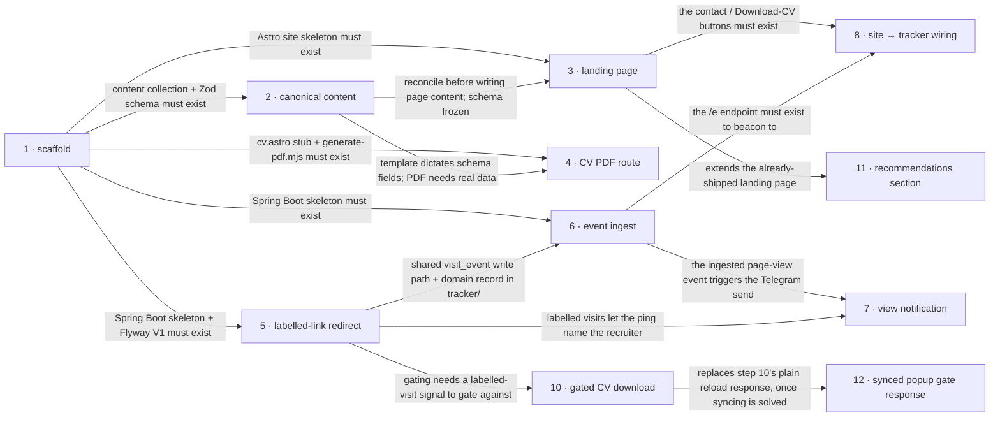

# Roadmap — personal-landing

> **A decomposition, not a promise.** The overall idea broken into incremental steps: what each
> step is, where it comes from, how big it is — or that nobody has looked at it yet — and in which
> order, and parallel lanes, we walk them. **No dates** (except shipped history), **no scores** —
> order is the prioritization. The *solution* for any step lives in its `docs/features/<slug>/`
> spec, not here.

## Destination

A recruiter opens one link, judges Roman's fit in ~20 seconds, taps to call / email / connect / download the CV, and Roman gets a real-time Telegram ping plus a per-recruiter visit log — all from a static site and one small tracker, both auto-deploying on commit.

## Steps

> **Working board:** [personal-landing Project](https://github.com/users/financeasist/projects/4) —
> the day-to-day view (per-issue `Status` + `Size` fields). This table stays the narrative source of
> truth; the Project mirrors the **Issue** column below. Issues also live in the milestones
> `personal-landing` / `tracking-system`.

| # | Step | Source | Size | Status | Issue |
|---|---|---|:---:|---|:---:|
| 1 | Scaffold the skeleton — monorepo, Astro site + Tailwind v4 + typed `profile` collection, Spring Boot tracker + Flyway V1, CI/deploy workflows, build-time PDF generator | `architecture-map.md` §Module inventory + `docs/features/_scaffold/tasks.json` | M | ✅ shipped | [#6](https://github.com/financeasist/personal-page/issues/6) |
| 2 | Canonical profile content — reconcile surname / employment dates / years-of-experience / the 2004→2017 period into one content-collection entry; lock the Zod schema to the reference template's sections | `idea-brief.md §2 Problem` + `idea-brief.md §6 Risks` + `idea-brief.md §8 Open questions` | S | ✅ shipped | [#7](https://github.com/financeasist/personal-page/issues/7) |
| 3 | Recruiter landing page — `index.astro`: name, one-line positioning, availability block, top stack, above-the-fold contact actions (phone / email / LinkedIn / Download CV); experience + selected projects below the fold; the shared `Section` / `ContactButton` / `AvailabilityBlock` / `ProjectCard` primitives. Recommendations block deferred to v2. → [`docs/features/personal-landing/spec.md`](features/personal-landing/spec.md) | `idea-brief.md §7 Recommendation` + `idea-brief.md §3 Users` | M | ✅ shipped | [#8](https://github.com/financeasist/personal-page/issues/8) |
| 4 | CV PDF route — `cv.astro` as a faithful reproduction of `docs/reference/cv-template-reference.pdf`, fed by the same `profile` collection; meaningfully-named PDF emitted at build | `architecture-map.md §Stack` (PDF generation) + `docs/adr/0004` | M | 🟡 v1 (committed PDF); build-time gen deferred | [#9](https://github.com/financeasist/personal-page/issues/9) |
| 5 | Labelled-link redirect — `/t/{label}` → 302 to the site, appends a visit event; `recruiter_link` rows seeded by hand, one per outreach → [`docs/features/tracking-system/spec.md`](features/tracking-system/spec.md) | `idea-brief.md §7 Recommendation` + `idea-brief.md §5 Out of scope` | M | **spec'd** | [#10](https://github.com/financeasist/personal-page/issues/10) |
| 6 | Cookieless event ingest — `/e` endpoint: page-view, contact-click (per channel), `cv_download`; city / referrer derivation; append-only → [`docs/features/tracking-system/spec.md`](features/tracking-system/spec.md) | `idea-brief.md §7 Recommendation` | M | **spec'd** | [#11](https://github.com/financeasist/personal-page/issues/11) |
| 7 | View notification — Telegram "page viewed" message to Roman on every visit; a labelled visit names the recruiter, an unlabelled one carries city / referrer → [`docs/features/tracking-system/spec.md`](features/tracking-system/spec.md) | `idea-brief.md §7 Recommendation` + `architecture-map.md §Stack` (Notifications) | S | **spec'd** | [#12](https://github.com/financeasist/personal-page/issues/12) |
| 8 | Site → tracker wiring — the inline `<script>` that beacons page-view + contact-click + `cv_download` to `/e`; the CV download proceeds regardless of the beacon (fire-and-forget) | `architecture-map.md §Frontend / UI foundation` (State / data-fetching) + `idea-brief.md §7 Recommendation` | S | idea | [#13](https://github.com/financeasist/personal-page/issues/13) |
| 9 | Per-recruiter "why I fit you" intro → see [Not yet specified](#not-yet-specified) | `idea-brief.md §6 Risks` | fog | idea | [#14](https://github.com/financeasist/personal-page/issues/14) |
| 10 | Recruiter-gated CV download — visitors arriving via a Labelled link download unconditionally; anonymous visitors submit which company's role they're being considered for, the backend verifies it (scrape the company's careers page, fall back to a job-board API), and either the download proceeds, a "no matching role, reach out instead" message shows, or — if verification itself fails — an honest "couldn't verify automatically, leave your email" fallback → [`idea-brief.md §6/§8`](idea-brief.md) | `idea-brief.md §8 Open questions` | fog | idea | [#20](https://github.com/financeasist/personal-page/issues/20) |
| 11 | Recommendations / testimonial section — below-the-fold quote/testimonial block on the landing page, deferred from step 3; additive to the `profile` schema, no quote material exists yet | `idea-brief.md §7 Recommendation` + `docs/features/personal-landing/spec.md` | S | idea | [#21](https://github.com/financeasist/personal-page/issues/21) |
| 12 | Synced popup-style gate response — replace step 10's plain "back to home" reload with a CSS-only (`:target`, no JS) modal pre-opened over a tracker-rendered clone of the landing page, so closing it needs no reload → see [Not yet specified](#not-yet-specified) | `idea-brief.md §6 Risks` | fog | idea | — |

## Not yet specified

| Area | What we'd have to learn | Blocks | How it gets sharpened |
|---|---|:---:|---|
| Per-recruiter "why I fit you" intro | Whether the intro is URL-param driven or tied to the `recruiter_link` label; whether its text lives in the content collection, in the tracker, or in the link query string; how it renders without flashing default content on a static page; whether it is even in v1 at all | 9 | A conversation with Roman, then a recon pass once the shape is chosen |
| Synced popup-style gate response | A mechanism to keep a tracker-rendered clone of the landing page in sync with the real Astro-built one, without violating "content is the single source of truth" or "no direct code sharing between site and tracker" (`CLAUDE.md`) — e.g. a build step that exports a shareable fragment/design tokens, or some other approach nobody's proposed yet. Explicitly parked behind step 10 (idea-brief.md, 2026-09-09): Roman likes the idea but only once syncing is solved. | 12 | Find a sync mechanism first (open-ended); a recon pass once one exists |
| Recruiter-gated CV download | **Resolved 2026-09-09 (idea-brief.md §6/§8):** labelled-link visitors bypass the gate unconditionally. Anonymous visitors fill one field — "which company's role are you presenting me for" (same field for in-house and agency recruiters, no agency detection branch) — submitted via a native HTML form (no client JS) straight to the tracker; the tracker scrapes that company's careers page server-side, falling back to a job-board aggregator API if inconclusive, then responds with a redirect to the CV (match), an HTML "reach out via LinkedIn/message instead" page (confirmed non-match), or an HTML "couldn't verify automatically, leave your email" page (verification failure, not folded into either match/non-match). Zero-client-JS posture confirmed compatible — chosen specifically over a JS async form because scripts can be blocked on a locked-down corporate recruiter laptop. Still open: real-world scrape hit-rate is unvalidated (a spike may show the email fallback carries most traffic), and the tracker gains a new HTML-response interaction shape alongside its existing JSON API — a `design`-level detail. | 10 | Ready for `classify-size` + `specify`; the scraping feasibility spike is the remaining risk to carry into that pass |

## Out of scope

- Browser-based admin panel / content-management UI — deferred to a later, separate feature; v1 content is file + git (`idea-brief.md §5`).
- Identifying anonymous visitors by name or company — not achievable on a public URL; "who" comes only from self-labelled per-recruiter links (`idea-brief.md §5`).
- Blog / articles / long-form writing — not what the twenty-second scan needs (`idea-brief.md §5`).
- Multiple language versions — English-only for v1; the schema and templates stay locale-clean so it is additive later (`idea-brief.md §5`, `architecture-map.md §Constraints`).
- Search-engine optimisation — traffic comes from links Roman sends, not search (`idea-brief.md §5`).
- Reshaping the CV layout — `cv.astro` is locked to `docs/reference/cv-template-reference.pdf`; only the section data changes (`architecture-map.md §Constraints`).

## Open decisions

| # | Question | Type | Owner | Blocks |
|---|---|:---:|:---:|:---:|
| D1 | ~~Which surname spelling is canonical?~~ **Resolved (personal-landing spec, 2026-09-06): Hrupskyi**. Contact email **updated 2026-09-08 to `roman@romanhrupskyi.com`** (apex-domain address; supersedes the earlier `roman.grupskyi@gmail.com` — committed CV PDF regenerated the same day). | grilling | human | 2 |
| D2 | ~~Which CV variant is the content base?~~ **Resolved: the reference template** (`cv-template-reference.pdf`); the "Classic" variant is reconciliation input only. | grilling | human | 2 |
| D3 | ~~How is the iGaming / EveryMatrix experience framed?~~ **Resolved (revised 2026-09-06): no content constraint** — Roman dropped the special framing rule; the iGaming / EveryMatrix work is described like any other role, on its engineering substance, with no requirement to downplay or foreground the domain. | grilling | human | 2 |
| D4 | What are the corrected, non-overlapping employment dates, and how is the 2004→2017 period presented? **Partially resolved:** 2004→2017 shown as a single "earlier background" line; exact date ranges still open (personal-landing spec §8). Tracked: [#15](https://github.com/financeasist/personal-page/issues/15). | grilling | human | 2 |
| D5 | ~~Is salary or rate expectation shown on the page?~~ **Resolved: no** — not shown; handled in conversation. | grilling | human | 3 |
| D6 | ~~Is informal storage of named-recruiter visit logs acceptable as-is, or is a retention / notice line needed?~~ **Resolved (tracking-system spec, 2026-09-06): indefinite retention**, offset by a manual, Roman-only erase-by-label operation (a hand-run database operation, not automatic expiry). | grilling | human | 5 |
| D7 | ~~Which contact channel is primary?~~ **Resolved: four equal above-the-fold actions** (phone / email / LinkedIn / Download CV); the phone action expands to two labelled call controls (Poland / international). | grilling | human | 3 |
| D8 | ~~Does the Download-CV click route through the tracking service?~~ **Resolved: no** — plain link + inline-script fire-and-forget beacon; the action never waits on the tracker. | task | agent | 6 |

## Decisions so far

- Astro static site with a typed content collection as the single source of truth → [`docs/adr/0001`](adr/0001-astro-static-site-with-typed-content-collection.md)
- Java / Spring Boot tracker with an append-only Postgres event log → [`docs/adr/0002`](adr/0002-java-spring-boot-tracker-with-append-only-postgres.md)
- Monorepo layout for site and tracker → [`docs/adr/0003`](adr/0003-monorepo-layout-for-site-and-tracker.md)
- `cv.pdf` generated from a print route at build time (not the committed "Classic" PDF) → [`docs/adr/0004`](adr/0004-generate-cv-pdf-from-a-print-route-at-build-time.md)
- Hosting: site on GitHub Pages, tracker on Fly.io (`waw`), Postgres on Supabase → [`docs/architecture-map.md §Stack`](architecture-map.md)
- The "Download CV" button is a primary above-the-fold action firing a tracked `cv_download` event → [`docs/idea-brief.md §8`](idea-brief.md)
- Recruiter landing page: no salary shown; four equal contact actions with a two-line phone chooser; contact details never shown as visible text (actionable controls only); recommendations block → v2; step 4 (CV PDF route) sequenced to land with step 3 → [`docs/features/personal-landing/spec.md`](features/personal-landing/spec.md)
- Step 3 re-sized L → M after the scaffold established the component/styling conventions the "L" estimate assumed → [`docs/features/personal-landing/spec.md`](features/personal-landing/spec.md)
- Steps 5+6+7 bundled into one `tracking-system` feature (M): a recruiter's labelled visit propagates its label via the redirect URL through to the event-ingest/notification path; every visit notifies in real time with no dedup; known link-preview crawlers are filtered and never counted; visit history is indefinite, offset by a manual Roman-only erase-by-label operation; both public endpoints carry a basic per-source rate limit → [`docs/features/tracking-system/spec.md`](features/tracking-system/spec.md)

## Dependency graph

## Execution path

> Every path below is `(new)` — the repo is greenfield and step 1 creates the tree. The zones
> come from `architecture-map.md §Module inventory` (the target baseline), so they are firm, but
> they are not verifiable against disk until the scaffold ships.

| Wave | Steps | Zone per step (why parallel-safe) | Unlocks |
|:---:|---|---|---|
| 1 | 1 | whole repo `(new)` — runs solo, nothing to parallelise against | 2, 3, 4, 5, 6 |
| 2 | 2 ∥ 5 | 2: `site/src/content/` `(new)` · 5: `tracker/` `(new)` — disjoint stacks | 3, 4, 6, 7 |
| 3 | 3 ∥ 4 ∥ 6 | 3: `site/src/components/` + `site/src/pages/index.astro` `(new)` · 4: `site/src/pages/cv.astro` + print styles `(new)` · 6: `tracker/src/main/java/.../web` + `.../app` `(new)` — schema frozen in wave 2, so the two `site/` lanes touch only their own page files | 7, 8 |
| 4 | 7 ∥ 8 ∥ 11 | 7: `tracker/src/main/java/.../app` + `.../infra` `(new)` · 8: `site/` inline `<script>` + component props `(new)` · 11: a new `site/src/components/` block + `site/src/data/profile/` content field `(new)` — disjoint stacks | — |

## Shipped

| Step | Shipped | Link |
|---|---|---|
| 1 · Scaffold the skeleton | 2026-09-06 (`b1583df`) | [#6](https://github.com/financeasist/personal-page/issues/6) |
| 2 · Canonical profile content | 2026-09 (`site/src/data/profile/roman.json` + `config.ts` invariants) | [#7](https://github.com/financeasist/personal-page/issues/7) |
| 3 · Recruiter landing page | 2026-09 ([PR #1](https://github.com/financeasist/personal-page/pull/1) + follow-ups: SEO, Person JSON-LD, favicons, apex domain) | [#8](https://github.com/financeasist/personal-page/issues/8) |
